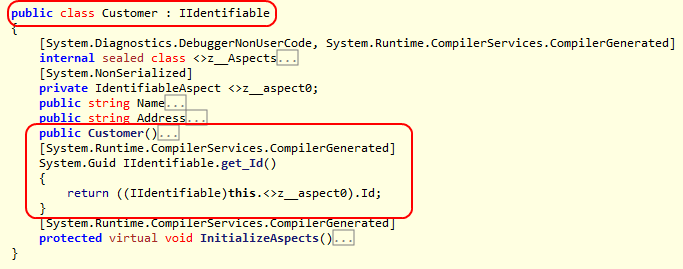
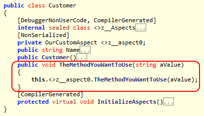
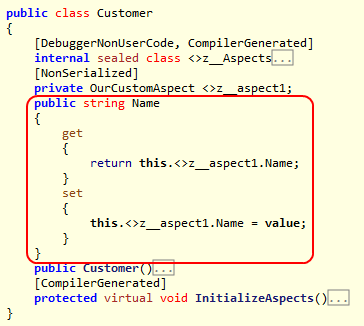

Some design patterns require you to add properties, methods or interfaces to your target code. If many components in your codebase need to represent the same construct, repetitively adding those constructs flies in the face of the DRY (Don't Repeat Yourself) principle. So how can you add code constructs to your target code without it becoming repetitive?

PostSharp offers a number of ways for you to add different code constructs to your codebase in a controlled and consistent manner. Let's take a look at those techniques.


## Introducing interfaces

One of the common situations that you will encounter is the need to implement a specific interface on a large number of classes. This may be <xref:System.ComponentModel.INotifyPropertyChanged>, <xref:System.IDisposable>, <xref:System.IEquatable`1> or some custom interface that you have created. If the implementation of the interface is consistent across all of the targets then there is no reason that we shouldn't centralize its implementation. So how do we go about adding that interface to a class at compile time? 


### 

1. Let's add the <xref:Microsoft.TeamFoundation.TestManagement.Client.IIdentifiable> interface to the target code. 

    ```csharp
    public interface IIdentifiable 
    { 
        Guid Id { get; }  
    }
    ```


2. Create an aspect that inherits from <xref:PostSharp.Aspects.InstanceLevelAspect> and add the custom attribute [<xref:PostSharp.Serialization.PSerializableAttribute>]. 


3. The key to adding an interface to target code is that you must implement that interface on your aspect. Let's implement the <xref:Microsoft.TeamFoundation.TestManagement.Client.IIdentifiable> interface on our aspect. It's this implementation of the interface that will be added to the target code, so anything that you include in method or property bodies will be added to the target code as you have declared it in the aspect. 

    ```csharp
    [PSerializable] 
    public class IdentifiableAspect : InstanceLevelAspect, IIdentifiable 
    { 
        public Guid Id { get; private set; } 
    }
    ```


4. Add the <xref:PostSharp.Aspects.Advices.IntroduceInterfaceAttribute> attribute to the aspect and include the interface type that you want to add to the target code. 

    ```csharp
    [IntroduceInterface(typeof(IIdentifiable))] 
    [PSerializable] 
    public class IdentifiableAspect : InstanceLevelAspect, IIdentifiable 
    { 
        public Guid Id { get; private set; } 
    }
    ```


5. Finally you need to declare where this aspect should be applied to the codebase. In this example, let's add it, as an attribute, to a class.

    ```csharp
    [IdentifiableAspect] 
    public class Customer 
    { 
        public string Name { get; set; } 
        public string Address { get; set; } 
    }
    ```


6. After compilation, you can decompile the target code and see that the interface has been added to it.

    


As you can see in the decompiled code, interfaces are implemented explicitly on the target code. It is also possible to introduce public members to target code. This is covered below.

> [!NOTE]
> Interfaces and members introduced by PostSharp are not visible at compile time. To access the dynamically applied interface you must make use of a special PostSharp feature; the <xref:PostSharp.Post.Cast``2(``0)> pseudo-operator. The <xref:PostSharp.Post.Cast``2(``0)> method will allow you to safely cast the target code to the interface type that was dynamically applied. Once that call has been done, you are able to make use of the instance through the interface constructs. 
There is no way to access a dynamically-inserted method, property or event, other than through reflection or the dynamic keyword.

> [!NOTE]
> When you start adding code constructs to your target code, you need to determine how to initialize them correctly. Because these code constructs are not available for you to work with at compile time you need to figure out how to deal with them some other way. To see more about initializing code constructs that you introduce via aspects, please see the section <xref:aspect-initialization>. 


## Introducing methods

The introduction of methods to your target code is very similar to introducing interfaces. The biggest difference is that you will be introducing code at a much more granular level.


### 

1. Create an aspect that inherits from <xref:PostSharp.Aspects.InstanceLevelAspect> and add the custom attribute [<xref:PostSharp.Serialization.PSerializableAttribute>]. 


2. Add to the aspect the method you want to introduce to the target code.

    ```csharp
    [PSerializable] 
    public class OurCustomAspect : InstanceLevelAspect 
    { 
        public void TheMethodYouWantToUse(string aValue) 
        { 
            Console.WriteLine("Inside a method that was introduced {0}", aValue); 
        } 
    }
    ```

    > [!NOTE]
    > The method that you declare must be marked as public. If it is not you will see an error at compile time.


3. Decorate the method with the <xref:PostSharp.Aspects.Advices.IntroduceMemberAttribute> attribute. 

    ```csharp
    [IntroduceMember] 
    public void TheMethodYouWantToUse(string aValue) 
    { 
        Console.WriteLine("Inside a method that was introduced {0}", aValue); 
    }
    ```


4. Finally, declare where you want this aspect to be applied in the codebase.

    ```csharp
    [OurCustomAspect] 
    public class Customer 
    { 
        public string Name { get; set; } 
    }
    ```


5. After compilation, you can decompile the target code and see that the method has been added.

    


## Introducing properties

The introduction of properties is almost exactly the same as the introduction of methods. Like introducing a method you will use the <xref:PostSharp.Aspects.Advices.IntroduceMemberAttribute> attribute. Let's take a look at the details. 


### 

1. Create an aspect that inherits from <xref:PostSharp.Aspects.InstanceLevelAspect> and add the custom attribute [<xref:PostSharp.Serialization.PSerializableAttribute>]. 


2. Add the property you want to introduce to the aspect.

    ```csharp
    [PSerializable] 
    public class OurCustomAspect : InstanceLevelAspect 
    { 
        public string Name { get; set; } 
    }
    ```

    > [!NOTE]
    > The property that you declare must be marked as public. If it is not you will see a compiler error.


3. Decorate the property with the <xref:PostSharp.Aspects.Advices.IntroduceMemberAttribute> attribute. 

    ```csharp
    [IntroduceMember] 
    public string Name { get; set; }
    ```


4. Add the aspect attribute to the target code where the aspect should be applied.

    ```csharp
    [OurCustomAspect] 
    public class Customer 
    { 
     
    }
    ```


5. After you have compiled the codebase you can decompile the target code and see that the property has been added.

    


As noted for both the introduction of methods and properties, the code being introduced must be declared as public. This is needed to ensure that PostSharp can function. If you look closely at the decompiled targets you will see that the introduced members are actually calling the methods/properties that were declared on the aspect. If the method/property on the aspect is not public, the target code will not be able to call it as it should.

> [!NOTE]
> It is possible to introduce properties to target code, but it is not possible to introduce fields to your target code. The reason is that all members are introduced by delegation: the actual implementation of the member always resides in the aspect.


## Controlling the visibility of introduced members

You may not want the introduced member to have public visibility once it has been introduced to the target code. PostSharp allows you to control the visibility of the introduced member through the use of the <xref:PostSharp.Aspects.Advices.IntroduceMemberAttribute.Visibility> property on the aspect. To declare that a member should be introduced with private visibility, all you have to do is declare it as such. 

```csharp
[IntroduceMember(Visibility = Visibility.Private)] 
public string Name { get; set; }
```

You have the ability to introduce members with a number of different visibilities including public, private, assembly (internal in C#) and others. You also have the ability to mark an introduction so that it will be declared as virtual if you set the <xref:PostSharp.Aspects.Advices.IntroduceMemberAttribute.IsVirtual> property to `true`. 

```csharp
[IntroduceMember(Visibility = Visibility.Private, IsVirtual = true)] 
public string Name { get; set; }
```


## Overriding members or interfaces

One thing you need to be aware of is the situation where you are introducing a member that may already exist in the scope of the target code. Perhaps the method you are trying to introduce is available on the target code through inheritance. It's possible that the method is explicitly declared on the target code as well. The introduction of a member via an aspect needs to take these situations into account. PostSharp allows you to take these situations into account through the use of the <xref:PostSharp.Aspects.Advices.IntroduceMemberAttribute.OverrideAction> property. 

The <xref:PostSharp.Aspects.Advices.IntroduceMemberAttribute.OverrideAction> property allows you to declare a rule for how the introduction of a member or interface should behave if the member or interface is already implemented on the target code. This property allows you to declare rules such as <xref:PostSharp.Aspects.Advices.MemberOverrideAction.Fail> (any conflict situation will throw a compile time error), <xref:PostSharp.Aspects.Advices.MemberOverrideAction.Ignore> (continue on without trying to introduce the member/interface), <xref:PostSharp.Aspects.Advices.MemberOverrideAction.OverrideOrFail> or <xref:PostSharp.Aspects.Advices.MemberOverrideAction.OverrideOrIgnore>. It's important to understand how you want to apply your introduced members/interfaces in situations where that member/interface may already exist. 

```csharp
[IntroduceMember(OverrideAction = MemberOverrideAction.Fail)] 
public string Name { get; set; }
```


## Introducing interfaces dynamically

The final technique that you can use to introduce code constructs to your target code is the <xref:PostSharp.Aspects.CompositionAspect>. When you create a <xref:PostSharp.Aspects.CompositionAspect> you are able to dynamically add interfaces to the target code at compile time and make use of that interface type at run time. 


### 

1. The first thing that you need to do is create an aspect that inherits from <xref:PostSharp.Aspects.CompositionAspect> and implements its members. 

    ```csharp
    [PSerializable] 
    public class GeneralCompose : CompositionAspect 
    { 
        public override object CreateImplementationObject(AdviceArgs args) 
        { 
            throw new System.NotImplementedException(); 
        } 
    }
    ```


2. Next, you need some way to tell the aspect what interface and concrete type you want to implement on the target code. To do that, create a constructor for your aspect that accepts two parameters; one for the interface type and one for the concrete implementation type. Assign those two constructor parameters to field-level variables so we can make use of them in the aspect.

    ```csharp
    [PSerializable] 
    public class GeneralCompose : CompositionAspect 
    { 
        private readonly Type _interfaceType; 
        private readonly Type _implementationType; 
     
        public GeneralCompose(Type interfaceType, Type implementationType) 
        { 
            _interfaceType = interfaceType; 
            _implementationType = implementationType; 
        }
    ```


3. There are two methods that you need to implement to complete this aspect. The first is an override of the <xref:PostSharp.Aspects.CompositionAspect.GetPublicInterfaces(System.Type)> method. This method has a target type parameter which allows you to filter the application of the interface if you choose to. For this example, simply return an array that contains the interface type that was provided via the aspect constructor. 

    ```csharp
    protected override Type[] GetPublicInterfaces(Type targetType) 
    { 
    return new[] { _interfaceType }; 
    }
    ```

    > [!NOTE]
    > The interfaces that are returned from the <xref:PostSharp.Aspects.CompositionAspect.GetPublicInterfaces(System.Type)> method will be applied to the target code during compilation. 


4. The second method that you need to override is <xref:PostSharp.Aspects.CompositionAspect.CreateImplementationObject(PostSharp.Aspects.AdviceArgs)>. For this example you will return an instance of the concrete implementation that was provided in the aspect constructor. The <xref:PostSharp.Aspects.CompositionAspect.CreateImplementationObject(PostSharp.Aspects.AdviceArgs)> method doesn't return the type of the concrete implementation. It returns an instance of that type instead. To create the instance use the <xref:PostSharp.Serialization.IActivator.CreateInstance(System.Type,PostSharp.Serialization.ActivatorSecurityToken)> method. 

    ```csharp
    public override object CreateImplementationObject(AdviceArgs args) 
    { 
    return Activator.CreateInstance(_implementationType); 
    }
    ```

    > [!NOTE]
    > The <xref:PostSharp.Aspects.CompositionAspect.CreateImplementationObject(PostSharp.Aspects.AdviceArgs)> method is invoked at the application run time. 


5. Now that you have created a complete <xref:PostSharp.Aspects.CompositionAspect>, it will need to be applied to the target code. Add the aspect to the target code as an attribute. Provide the attribute with the interface and concrete types that you wish to implement. 

    ```csharp
    [GeneralCompose(typeof(IList), typeof(ArrayList))] 
    public class Fruit 
    {  
    }
    ```


6. After compiling your application you will find that the target code now implements the assigned interfaces and exposes itself as a new instance of the concrete type you declared. The next question that needs addressing is how you will interact with the target code using that interface type.

    To access the dynamically applied interface you must make use of a special PostSharp feature. The <xref:PostSharp.Post.Cast``2(``0)> method will allow you to safely cast the target code to the interface type that you dynamically applied. Once that call has been done, you are able to make use of the instace through the interface constructs. 

    ```csharp
    [GeneralCompose(typeof(IList), typeof(ArrayList))] 
    public class Fruit 
    { 
        public Fruit() 
        { 
            IList list = Post.Cast<Fruit,IList>(this); 
            list.Add("apple"); 
            list.Add("orange"); 
            list.Add("banana"); 
        } 
    }
    ```


## See Also

**Reference**

<xref:PostSharp.Aspects.CompositionAspect.CreateImplementationObject(PostSharp.Aspects.AdviceArgs)>
<br><xref:PostSharp.Aspects.CompositionAspect>
<br><xref:PostSharp.Post.Cast``2(``0)>
<br><xref:System.ComponentModel.INotifyPropertyChanged>
<br><xref:System.IDisposable>
<br><xref:PostSharp.Aspects.InstanceLevelAspect>
<br><xref:PostSharp.Serialization.PSerializableAttribute>
<br><xref:PostSharp.Aspects.Advices.IntroduceInterfaceAttribute>
<br><xref:PostSharp.Aspects.Advices.IntroduceMemberAttribute>
<br><xref:PostSharp.Aspects.Advices.IntroduceMemberAttribute.Visibility>
<br><xref:PostSharp.Aspects.Advices.IntroduceMemberAttribute.IsVirtual>
<br><xref:PostSharp.Aspects.Advices.IntroduceMemberAttribute.OverrideAction>
<br><xref:PostSharp.Aspects.Advices.MemberOverrideAction.Fail>
<br><xref:PostSharp.Aspects.Advices.MemberOverrideAction.Ignore>
<br><xref:PostSharp.Aspects.Advices.MemberOverrideAction.OverrideOrFail>
<br><xref:PostSharp.Aspects.Advices.MemberOverrideAction.OverrideOrIgnore>
<br><xref:PostSharp.Aspects.CompositionAspect.GetPublicInterfaces(System.Type)>
<br><xref:PostSharp.Aspects.CompositionAspect.CreateImplementationObject(PostSharp.Aspects.AdviceArgs)>
<br><xref:PostSharp.Serialization.IActivator.CreateInstance(System.Type,PostSharp.Serialization.ActivatorSecurityToken)>
<br>