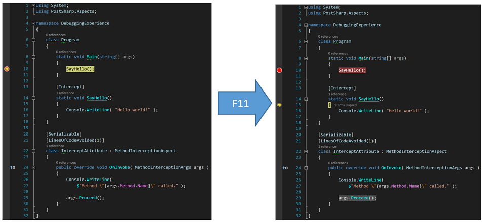
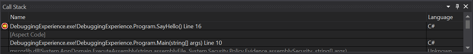
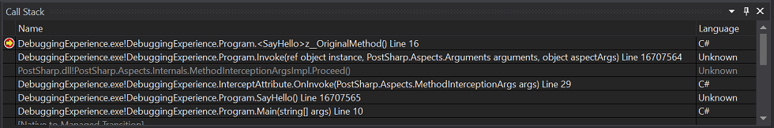
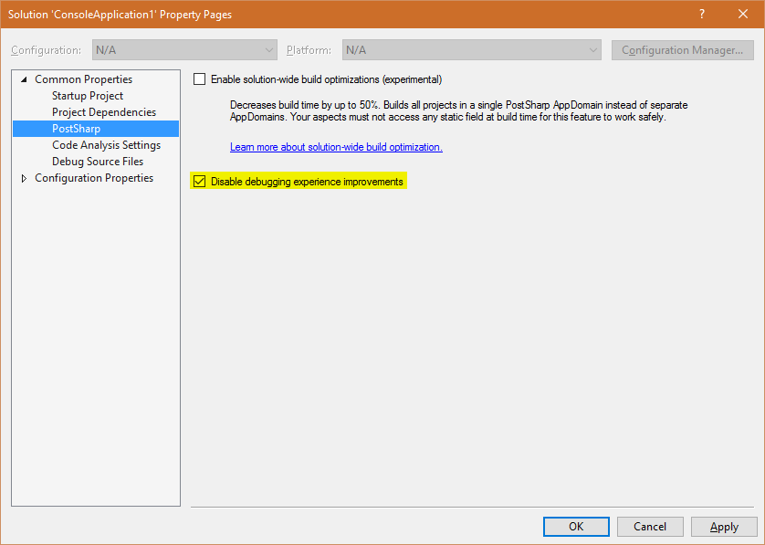

# Debugging Run-Time Logic

Enhancing your code with aspects gives you a new dimension to your debugging experience. With PostSharp, patterns are implemented in classes that are separate from the business logic. Most of the time, you will want to debug just the business logic. But sometimes, you will want to debug the aspects: aspect code will now be skipped by default during step-into sessions and in the call stack window.

## Stepping into aspect code

Suppose you have a `SayHello` method intercepted by an `Intercept` aspect. You are about to step into the `SayHello` method. By default, the debugger steps over the code of the `Intercept` aspect and then breaks in the beginning of the `SayHello` method. When Step Into Aspects is enabled, the debugger will step into the `Intercept` aspect. 

The Step Into Aspects feature is disabled by default. To turn it on, go to the menu **PostSharp / Options**, then to the **General** tab and the **Debugging** section, and check the **Step Into Aspects** check box. Now you can step into aspects using the **Step Into (F11)** command of the debugger. 

## Showing aspects code in the call stack window

By default, all the calls to the methods of the `Intercept` aspect are hidden behind one stack frame named `[Aspect Code]`. Suppose you have the `SayHello` method intercepted by the `Intercept` aspect like in the example above. You are inside the `SayHello` method. In the call stack, all the methods introduced by PostSharp are hidden. 

Sometimes you may need to see the real call stack that includes all intermediate method calls generated by PostSharp. This is the purpose of the **Show Aspects Code in Call Stack** feature. 

To turn it on, go to the menu **PostSharp / Options**, then to the **General** tab and the **Debugging** section, and check the **Show Aspects Code in Call Stack** check box. Now, the call stack includes all the methods introduced by PostSharp. 

## Disabling debugger enhancements

PostSharp improves your debugging experience by installing extensions for the Visual Studio Debugger and by enhancing PDB files during the build. In some use cases you may want to disable these PostSharp debugger extensions and revert back to the default debugging behavior in Visual Studio (e.g. building for a new or unsupported target framework, debugging code on unsupported devices, working around bugs, etc.).

### To disable PostSharp debugger extensions:

1. Right-click on your solution in the **Solution Explorer** and then click **Properties** 

2. On the **PostSharp** page of the displayed solution property pages dialog, select the check box **Disable debugging experience improvements**. 

    

3. Confirm the change by clicking **OK** and then rebuild your solution. 

> [!NOTE]
> Debugging extensions are automatically disabled when you build your project using MSBuild from outside Visual Studio.

> [!WARNING]
> If you build a solution with debugging extensions enabled, you must debug the solution with an instance of Visual Studio where debugging extensions are enabled, otherwise your debugging experience will be frustrating.

