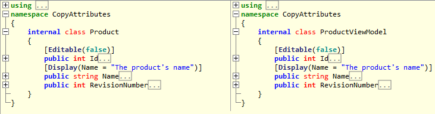

# Introducing Custom Attributes

Applying custom attributes to class members in C# is a powerful way to add metadata about those members at compile time.

PostSharp provides the ability to create a custom attribute class which when applied to another class, can iterate through those class members and automatically decorate them with custom attributes. This can be useful for example, to automatically apply custom attributes or groups of custom attributes when new class members are added, without having to remember to do it manually each time.


## Introducing new custom attributes

In the following example, we’ll create an attribute decorator class which applies .NET’s <xref:System.Runtime.Serialization.DataContractAttribute> to a class and <xref:System.Runtime.Serialization.DataMemberAttribute> to members of a class at build time. 


### 

1. Start by creating a class called `AutoDataContractAttribute` which derives from <xref:PostSharp.Aspects.TypeLevelAspect>. <xref:PostSharp.Aspects.TypeLevelAspect> transforms the class into an attribute which can be applied to other classes. Also implement <xref:PostSharp.Aspects.IAspectProvider> which exposes the <xref:PostSharp.Aspects.IAspectProvider.ProvideAspects(System.Object)> method for iterating on class members. <xref:PostSharp.Aspects.IAspectProvider.ProvideAspects(System.Object)> will be called for each member in the target class and will contain the code for applying the attributes: 

    ```csharp
    public sealed class AutoDataContractAttribute : TypeLevelAspect, IAspectProvider
    {
        public IEnumerable<AspectInstance> ProvideAspects(object targetElement)
        {
    }
    ```


2. Implement the <xref:PostSharp.Aspects.IAspectProvider.ProvideAspects(System.Object)> method to cast the `targetElement` parameter to a `Type` object. Note that this method will be called at build time. Since <xref:PostSharp.Aspects.IAspectProvider.ProvideAspects(System.Object)> will be called for the class itself and for each member of the target class, the `Type` object can be used for inspecting each member and making decisions about when and how to apply custom attributes. In the following snippet, the implementation returns a new <xref:PostSharp.Aspects.AspectInstance> for the `Type` containing a new <xref:System.Runtime.Serialization.DataContractAttribute> and then iterates through each property of the `Type` returning a new <xref:PostSharp.Aspects.AspectInstance> with the <xref:System.Runtime.Serialization.DataMemberAttribute> for each. Note that both the <xref:System.Runtime.Serialization.DataContractAttribute> and <xref:System.Runtime.Serialization.DataMemberAttribute> are both wrapped in <xref:PostSharp.Aspects.CustomAttributeIntroductionAspect> objects: 

    ```csharp
    public sealed class AutoDataContractAttribute : TypeLevelAspect, IAspectProvider
    {
        // This method is called at build time and should just provide other aspects. 
        public IEnumerable<AspectInstance> ProvideAspects(object targetElement)
        {
            Type targetType = (Type) targetElement;
    
            CustomAttributeIntroductionAspect introduceDataContractAspect =
                new CustomAttributeIntroductionAspect(
                    new ObjectConstruction(typeof (DataContractAttribute).GetConstructor(Type.EmptyTypes)));
            CustomAttributeIntroductionAspect introduceDataMemberAspect =
                new CustomAttributeIntroductionAspect(
                    new ObjectConstruction(typeof (DataMemberAttribute).GetConstructor(Type.EmptyTypes)));
    
    
            // Add the DataContract attribute to the type. 
            yield return new AspectInstance(targetType, introduceDataContractAspect);
    
            // Add a DataMember attribute to every relevant property. 
            foreach (PropertyInfo property in 
                targetType.GetProperties(BindingFlags.Public | BindingFlags.DeclaredOnly | BindingFlags.Instance))
            {
                if (property.CanWrite)
                    yield return new AspectInstance(property, introduceDataMemberAspect);
            }
        }
    }
    ```

    > [!NOTE]
    > Since the `ProvideAspects` method returns an `IEnumerable`, the yield keyword should be used to return aspects for PostSharp to apply. 


3. Apply the `AutoDataContractAttribute` class. In the following example we apply it to a `Product` class where it will decorate `Product` with <xref:System.Runtime.Serialization.DataContractAttribute> and each member with <xref:System.Runtime.Serialization.DataMemberAttribute>: 

    ```csharp
    [AutoDataContractAttribute]
    public class Product
    {
        public int ID { get; set; }
    
        public string Name { get; set; }
    
        public int RevisionNumber { get; set; }
    }
    ```


## Copying existing custom attributes

Another way to introduce attributes to class members is to copy them from another class. This is useful, for example, when distinct classes have members with the same names and are of the same types. In this case, attributes can be defined in one class and then that class can be used to decorate other similar classes with same attributes.

In the following snippet, `Product` ’s `ID` and `Name` properties have both been modified to contain an additional attribute from the `System.ComponentModel.DataAnnotations` namespace – `Editable`, `Display`, and `Required` respectively. Below `Product` is another class called `ProductViewModel` containing the same properties to which we want to copy the attributes to: 

```csharp
class Product
{
    [EditableAttribute(false)]
    [Required]
    public int Id { get; set; }

    [Display(Name = "The product's name")]
    [Required] 
    public string Name { get; set; }
    public int RevisionNumber { get; set; }
}

class ProductViewModel
{        
    public int Id { get; set; }
    public string Name { get; set; }
    public int RevisionNumber { get; set; }
}
```

To copy the attributes from the properties of `Product` to the corresponding properties of `ProductViewModel`, create an attribute class which can be applied to `ProductViewModel` to perform this copy process: 


### 

1. Create a <xref:PostSharp.Aspects.TypeLevelAspect> which implements <xref:PostSharp.Aspects.IAspectProvider>. In the snippet below our class is called `CopyCustomAttributesFrom`: 

    ```csharp
    class CopyCustomAttributesFrom : TypeLevelAspect, IAspectProvider
    {
    }
    ```


2. Create a constructor to take in the class type from which the property attributes are to be copied from. This class type will be used in the next step to enumerate its properties:

    ```csharp
    class CopyCustomAttributesFrom : TypeLevelAspect, IAspectProvider
    {
    private Type sourceType;
    
    public CopyCustomAttributesFrom(Type srcType)
    {
        sourceType = srcType;
    }
    	}
    ```


3. Implement <xref:PostSharp.Aspects.IAspectProvider.ProvideAspects(System.Object)>: 

    ```csharp
    class CopyCustomAttributesFrom : TypeLevelAspect, IAspectProvider
    {
    	// Details skipped.
    
    	public IEnumerable<AspectInstance> ProvideAspects(object targetElement)
    	{        
    	    Type targetClassType = (Type)targetElement;
    	
    	    //loop thru each property in target
    	    foreach (PropertyInfo targetPropertyInfo in targetClassType.GetProperties())
    	    {
    	        PropertyInfo sourcePropertyInfo = sourceType.GetProperty(targetPropertyInfo.Name);
    	        
    	        //loop thru all custom attributes for the source property and copy to the target property
    	        foreach (CustomAttributeData customAttributeData in sourcePropertyInfo.GetCustomAttributesData())
    	        {   
    	            //filter out attributes that aren’t DataAnnotations                 
    	            if (customAttributeData.AttributeType.Namespace.Equals("System.ComponentModel.DataAnnotations"))
    	            {
    	                CustomAttributeIntroductionAspect customAttributeIntroductionAspect =
    	                    new CustomAttributeIntroductionAspect(new ObjectConstruction(customAttributeData));
    	
    	                yield return new AspectInstance(targetPropertyInfo, customAttributeIntroductionAspect);
    	            }
    	        }
    	        
    	    }                      
    	}
    }
    ```

    The <xref:PostSharp.Aspects.IAspectProvider.ProvideAspects(System.Object)> method iterates through each property of the target class and then gets the corresponding property from the source class. It then iterates through all custom attributes defined for the source property, copying each to the corresponding property of the target class. <xref:PostSharp.Aspects.IAspectProvider.ProvideAspects(System.Object)> also filters out attributes which aren’t from the `System.ComponentModel.DataAnnotations` namespace to demonstrate how you may want to ignore some attributes during the copy process. 


4. Decorate the `ProductViewModel` class with the `CopyCustomAttributesFrom` attribute, specifying `Product` as the source type in the constructor. During compilation, `CopyCustomAttributesFrom` ’s <xref:PostSharp.Aspects.IAspectProvider.ProvideAspects(System.Object)> method will then perform the copy process from `Product` to `ProductViewModel`: 

    ```csharp
    [CopyCustomAttributesFrom(typeof(Product))]
    class ProductViewModel
    {        
        // Details skipped.
    }
    ```


The following screenshot shows the `Product` and `ProductViewModel` classes reflected from an assembly. Here we can see that the `Editable` and `Display` attributes were copied from `Product` to `ProductViewModel` using <xref:PostSharp.Aspects.Advices.CopyCustomAttributesAttribute> at build time: 



> [!NOTE]
> It is not possible to delete or replace an existing custom attribute.

## See Also

**Reference**

<xref:PostSharp.Aspects.IAspectProvider.ProvideAspects(System.Object)>
<br><xref:PostSharp.Aspects.Advices.CopyCustomAttributesAttribute>
<br><xref:System.Runtime.Serialization.DataContractAttribute>
<br><xref:System.Runtime.Serialization.DataMemberAttribute>
<br><xref:PostSharp.Aspects.TypeLevelAspect>
<br><xref:PostSharp.Aspects.IAspectProvider>
<br><xref:PostSharp.Aspects.AspectInstance>
<br><xref:PostSharp.Aspects.CustomAttributeIntroductionAspect>
<br>