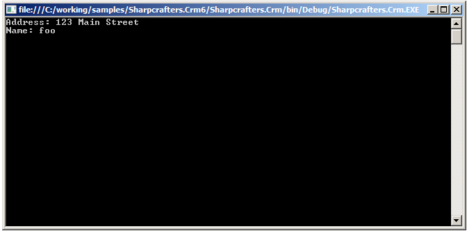

# Intercepting Properties and Fields

In .NET, both fields and properties are "things" that can be set and get. You can intercept get and set operations using the <xref:PostSharp.Aspects.LocationInterceptionAspect>. It makes it possible to develop useful aspects, such as validation, filtering, change tracking, change notification, or property virtualization (where the property is backed by a registry value, for instance). 


## Intercepting Get operations

In this example, we will see how to create an aspect that filters the value read from a field or property.


### To create an aspect that filters the value read from a field or property

1. Add a reference to the *PostSharp* package to your project. 


2. Create an aspect that inherits from <xref:PostSharp.Aspects.LocationInterceptionAspect> and add the custom attribute [<xref:PostSharp.Serialization.PSerializableAttribute>]. 


3. Override the <xref:PostSharp.Aspects.LocationInterceptionAspect.OnGetValue(PostSharp.Aspects.LocationInterceptionArgs)> method. 

    ```csharp
    [PSerializable] 
    public class StringCheckerAttribute : LocationInterceptionAspect 
    { 
        public override void OnGetValue(LocationInterceptionArgs args) 
        { 
            base.OnGetValue(args); 
        } 
     
    }
    ```


4. Calling `base.OnGetValue` actually retrieves the value from the underlying field or property, and populates the <xref:PostSharp.Aspects.LocationInterceptionArgs.Value> property. Add some code to check if the property currently is set to `null` If the current value is `null`, we want to return a predefined value. To do this we can set the <xref:PostSharp.Aspects.LocationInterceptionArgs.Value> property. Any time this property is requested, and it is set to `null`, the value `"foo"` will be returned. 

    ```csharp
    public override void OnGetValue(LocationInterceptionArgs args) 
    { 
        base.OnGetValue(args); 
     
        if (args.Value == null) 
        { 
            args.Value = "foo"; 
        } 
    }
    ```


5. Now that you have a complete getter interception aspect written you can attach it to the target code. Simply add an attribute to either properties or fields to have the interception attached.

    ```csharp
    public class Customer 
    { 
        [StringChecker] 
        private readonly string _address; 
     
        public Customer(string address) 
        { 
            _address = address; 
        } 
        
        [StringChecker] 
        public string Name { get; set; } 
        public string Address { get { return _address; } } 
    }
    ```

    > [!NOTE]
    > Adding aspects to target code one property or field at a time can be a tedious process. There are a number of techniques in the article <xref:attribute-multicasting> that explain how to add aspects en mass. 


6. Now when you create an instance of a customer and immediately try to access the `Name` and `Address` values the get request will be intercepted and null values will be returned as `"foo"`. 

    ```csharp
    class Program 
    { 
        static void Main(string[] args) 
        { 
            var customer = new Customer("123 Main Street"); 
            Console.WriteLine("Address: {0}", customer.Address); 
            Console.WriteLine("Name: {0}", customer.Name); 
            Console.ReadKey(); 
        } 
    }
    ```

    


Property and field interception is a simple and seamless task. Once you have intercepted your target you can act on the target or you can allow the original code to execute.


## Intercepting Set operations

The previous section showed how to intercept a get accessor. Intercepting a set accessor is accomplished in a similar manner by implementing <xref:PostSharp.Aspects.LocationInterceptionAspect.OnSetValue(PostSharp.Aspects.LocationInterceptionArgs)> in the <xref:PostSharp.Aspects.LocationInterceptionAspect>. 

The following snippet shows the addition of <xref:PostSharp.Aspects.LocationInterceptionAspect.OnSetValue(PostSharp.Aspects.LocationInterceptionArgs)> to the `StringCheckerAttribute` example: 

```csharp
[PSerializable] 
public class StringCheckerAttribute : LocationInterceptionAspect 
{ 
    public override void OnGetValue(LocationInterceptionArgs args) 
    { 
        base.OnGetValue(args); 
    } 
   
    public override void OnSetValue(LocationInterceptionArgs args) 
    { 
        base.OnSetValue(args); 
    } 
}
```

When applied to a property with a set operator, <xref:PostSharp.Aspects.LocationInterceptionAspect.OnSetValue(PostSharp.Aspects.LocationInterceptionArgs)> will intercept the set operation. In the `Customer` example shown below, <xref:PostSharp.Aspects.LocationInterceptionAspect.OnSetValue(PostSharp.Aspects.LocationInterceptionArgs)> will be called whenever the `Name` property is set: 

```csharp
public class Customer 
{ 
	// ...
	
    [StringChecker]
    public string Name { get; set; } 
}
```

You can set the <xref:PostSharp.Aspects.LocationInterceptionArgs.Value> property of <xref:PostSharp.Aspects.LocationInterceptionArgs> and then call <xref:PostSharp.Aspects.LocationInterceptionArgs.ProceedSetValue> to pass a different value in for the property. For example, <xref:PostSharp.Aspects.LocationInterceptionAspect.OnSetValue(PostSharp.Aspects.LocationInterceptionArgs)> could be used to check for a null string, and then change the string to a non-null value: 

```csharp
[PSerializable] 
public class StringCheckerAttribute : LocationInterceptionAspect 
{ 
    public override void OnSetValue(LocationInterceptionArgs args) 
    { 
        if (args.Value == null)
        {
            args.Value = "Empty String";
        } 
              
        args.ProceedSetValue();
    } 
}
```

> [!WARNING]
> Inline initializers of instance fields and properties are not intercepted by <xref:PostSharp.Aspects.LocationInterceptionAspect.OnSetValue(PostSharp.Aspects.LocationInterceptionArgs)>. To react to the initialization of an instance field or property, use the <xref:PostSharp.Aspects.LocationInterceptionAspect.OnInstanceLocationInitialized(PostSharp.Aspects.LocationInitializationArgs)> advice. See [Reacting to initialization of instance fields and properties](#reacting-to-initialization-of-instance-fields-and-properties) for details. 


## Getting and setting the underlying property

PostSharp provides a mechanism to check a property’s underlying value via the <xref:PostSharp.Aspects.LocationInterceptionArgs.GetCurrentValue> method. This can be useful to check the current property value when a setter is called and then take some appropriate action. 

For example, the following snippet shows a modified <xref:PostSharp.Aspects.LocationInterceptionAspect.OnSetValue(PostSharp.Aspects.LocationInterceptionArgs)> method which gets the current underlying property value and compares the (new) value passed into the setter against the current value. If current and new value don’t match then some message is written: 

```csharp
public override void OnSetValue(LocationInterceptionArgs args)
{
    // get the current underlying value
    string existingValue = (string)args.GetCurrentValue();

    if (((existingValue==null) && (args.Value != null)) || (!existingValue.Equals(args.Value)))
    {
        Console.WriteLine("Value changed.");
        args.ProceedSetValue();
    }
}
```

> [!NOTE]
> <xref:PostSharp.Aspects.LocationInterceptionArgs.GetCurrentValue> will call the underlying property getter without going through <xref:PostSharp.Aspects.LocationInterceptionAspect.OnGetValue(PostSharp.Aspects.LocationInterceptionArgs)>. If several aspects are applied to the property (and/or to the property setter), <xref:PostSharp.Aspects.LocationInterceptionArgs.GetCurrentValue> will go through the next aspect in the chain of invocation. 

PostSharp also provides a mechanism to set the underlying property in a getter via the <xref:PostSharp.Aspects.LocationInterceptionArgs.SetNewValue(System.Object)> method of <xref:PostSharp.Aspects.LocationInterceptionArgs>. This could be used for example, to ensure that a default value is assigned to the underlying property if there is currently no value. The following snippet shows a modified <xref:PostSharp.Aspects.LocationInterceptionAspect.OnGetValue(PostSharp.Aspects.LocationInterceptionArgs)> method which gets the current underlying value, and sets a default value if the current value is null: 

```csharp
public override void OnGetValue(LocationInterceptionArgs args)
        {
            object o = args.GetCurrentValue();
            if (o == null)
            {
                args.SetNewValue("value not set");
            }

            base.OnGetValue(args);
        }
```


## Intercepting fields

One benefit to implementing a <xref:PostSharp.Aspects.LocationInterceptionAspect> is that it can be applied directly to fields, allowing for reads and writes to those fields to be intercepted, just like with properties. 

Applying a <xref:PostSharp.Aspects.LocationInterceptionAspect> implementation to a field is simply a matter of setting it as an attribute on a field, just as it was done with a property: 

```csharp
public class Customer 
{ 
    // ...
    
    [StringChecker]
    public string name; 
}
```

With the attribute applied to the name field, all attempts to get and set that field will be intercepted by `StringChecker` in its <xref:PostSharp.Aspects.LocationInterceptionAspect.OnGetValue(PostSharp.Aspects.LocationInterceptionArgs)> and <xref:PostSharp.Aspects.LocationInterceptionAspect.OnSetValue(PostSharp.Aspects.LocationInterceptionArgs)> methods. 

Note that when a <xref:PostSharp.Aspects.LocationInterceptionAspect> is added to a field, the field is replaced by a property of the same field and visibility. The field itself is renamed and made private. 


## Getting the property or property being accessed

Information about the property or field being intercepted can be obtained through the <xref:PostSharp.Aspects.LocationInterceptionArgs> via its <xref:PostSharp.Aspects.LocationInterceptionArgs.Binding> property. 

Here you will find <xref:PostSharp.Aspects.ILocationBinding.LocationInfo> which can represent a <xref:PostSharp.Reflection.LocationInfo.FieldInfo>, a <xref:PostSharp.Reflection.LocationInfo.PropertyInfo>, or a <xref:PostSharp.Reflection.LocationInfo.ParameterInfo> (although <xref:PostSharp.Aspects.LocationInterceptionAspect> cannot be added to parameters). 

One use for this is to reflect the property name whenever a property is changed. In the following example, we have an `Entity` class that implements <xref:System.ComponentModel.INotifyPropertyChanged> and a public `OnPropertyChanged` method which allows notifications to be made whenever a property is changed. The `Customer` class has been modified to derive from `Entity`. 

```csharp
class Entity : INotifyPropertyChanged
{
    public event PropertyChangedEventHandler PropertyChanged;
  
    public void OnPropertyChanged(string propertyName)
    {
        if (PropertyChanged != null)
            PropertyChanged(this, new PropertyChangedEventArgs(propertyName));
    }
}

class Customer : Entity
{
    public string Name { get; set; }
}
```

With the ability to invoke an `OnPropertyChanged` event, we can create a <xref:PostSharp.Aspects.LocationInterceptionAspect> which invokes this event when setting a value and pass in the property name from the underlying <xref:PostSharp.Reflection.LocationInfo.PropertyInfo> object: 

```csharp
[PSerializable] 
public class NotifyPropertyChangedAttribute : LocationInterceptionAspect 
{ 
    public override void OnSetValue(LocationInterceptionArgs args) 
    { 
        if ( args.Value != args.GetCurrentValue() )
        {
            args.Value = args.Value;
            args.ProceedSetValue();
            ((Entity)args.Instance).OnPropertyChanged(args.Binding.LocationInfo.Name);
        } 
    } 
}
```

> [!NOTE]
> This example is a simplistic implementation of the <xref:PostSharp.Patterns.Model.NotifyPropertyChangedAttribute> aspect. For a production-ready implementation, see the section <xref:inotifypropertychanged>. 

This aspect can then be applied to the `Customer` class: 

```
[NotifyPropertyChangedAttribute]
class Customer : INotifyPropertyChanged
{
	public string Name { get; set; }
}
```

Now when the `Name` property is changed, <xref:PostSharp.Patterns.Model.NotifyPropertyChangedAttribute> will invoke the `Entity.OnPropertyChanged` method passing in the property name retrieved from its underlying property. 


## Reacting to initialization of instance fields and properties

C# and VB.NET allow fields and properties to be initialized on the same line as their declaration instead of in the constructor. This is called the *initialization* of the field or property. While the initialization of *static* fields and properties can be intercepted by <xref:PostSharp.Aspects.LocationInterceptionAspect.OnSetValue(PostSharp.Aspects.LocationInterceptionArgs)>, this method will not be called while initializing instance fields or properties. The reason for that limitation is that the <xref:PostSharp.Aspects.LocationInterceptionAspect.OnSetValue(PostSharp.Aspects.LocationInterceptionArgs)> method requires a valid `this` object, which we don't have because inline initialization is performed before the base constructor has been called. 

The initialization of instance fields or properties cannot be intercepted. However, you can react to their initial value by implementing the <xref:PostSharp.Aspects.LocationInterceptionAspect.OnInstanceLocationInitialized(PostSharp.Aspects.LocationInitializationArgs)> advice. This advice will be invoked after the completion of the base constructor and before the execution of your own constructor. 


## Example

Suppose you have an item in an auction and you want to take an action each time the price of the item changes. You have the following class:

```csharp
class AuctionItem
{
    [Report]
    public int Price { get; set; } = 40000;
}
```

And you write your <xref:PostSharp.Aspects.LocationInterceptionAspect>: 

```csharp
[Serializable]
class ReportAttribute : LocationInterceptionAspect
{
    public void OnSetValue(LocationInterceptionArgs args) 
    {
        args.ProceedSetValue();
        Console.WriteLine("The " + args.LocationName + " of the item changed to " + args.Value);
    }
    
    public void OnInstanceLocationInitialized(LocationInitializationArgs args)
    {
        Console.WriteLine("The " + args.LocationName + " of the item starts out at " + args.Value);
    }
}
```

Then the following code snippet:

```csharp
AuctionItem item = new AuctionItem(); 
item.Price += 2000;
```

will have this output: ```none
The Price of the item starts out at 40000
The Price of the item changed to 42000
```

 

See the Remarks section of <xref:PostSharp.Aspects.LocationInterceptionAspect.OnSetValue(PostSharp.Aspects.LocationInterceptionArgs)> and <xref:PostSharp.Aspects.LocationInterceptionAspect.OnInstanceLocationInitialized(PostSharp.Aspects.LocationInitializationArgs)> for more details. 

## See Also

**Reference**

<xref:PostSharp.Aspects.LocationInterceptionAspect>
<br><xref:PostSharp.Aspects.LocationInterceptionAspect.OnGetValue(PostSharp.Aspects.LocationInterceptionArgs)>
<br><xref:PostSharp.Aspects.LocationInterceptionAspect.OnSetValue(PostSharp.Aspects.LocationInterceptionArgs)>
<br><xref:PostSharp.Aspects.LocationInterceptionAspect.OnInstanceLocationInitialized(PostSharp.Aspects.LocationInitializationArgs)>
<br><xref:PostSharp.Aspects.LocationInterceptionArgs>
<br><xref:PostSharp.Aspects.LocationInitializationArgs>
<br><xref:PostSharp.Aspects.LocationInterceptionArgs.Location>
<br><xref:PostSharp.Reflection.LocationInfo>
<br><xref:PostSharp.Reflection.LocationInfo.FieldInfo>
<br><xref:PostSharp.Reflection.LocationInfo.PropertyInfo>
<br><xref:PostSharp.Reflection.LocationInfo.ParameterInfo>
<br><xref:System.ComponentModel.INotifyPropertyChanged>
<br><xref:PostSharp.Patterns.Model.NotifyPropertyChangedAttribute>
<br>**Other Resources**

<xref:attribute-multicasting>
<br><xref:inotifypropertychanged>
<br>