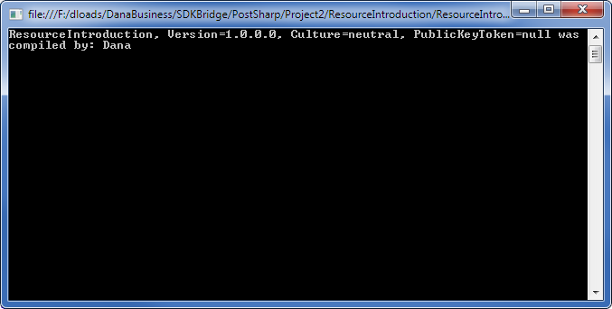

# Introducing Managed Resources

Embedding resources in .NET allows for data to be packaged together with your code in an assembly. Resources are normally specified at design time and then embedded by the compiler during build time.

PostSharp’s <xref:PostSharp.Aspects.AssemblyLevelAspect> adds additional flexibility by allowing you to programmatically add resources at compile time. In doing so you can add logic and therefore flexibility in determining which resources get embedded and how. For example, you could use this feature to encrypt a resource just before embedding it into your assembly. 


## Introducing resources

In the following example, we’ll create an assembly decorator which retrieves the current date and time during compilation, and then stores that information in the current assembly as a resource. The example will then show that that information can be retrieved from the assembly at run time.


### 

1. Start by creating a class called `AddBuildInfoAspect` which derives from <xref:PostSharp.Aspects.AssemblyLevelAspect>. Also implement <xref:PostSharp.Aspects.IAspectProvider> which exposes the <xref:PostSharp.Aspects.IAspectProvider.ProvideAspects(System.Object)> method. The <xref:PostSharp.Aspects.IAspectProvider.ProvideAspects(System.Object)> method will be called once by PostSharp, providing access to assembly information and allowing for a resource to be programmatically added to the assembly: 

    ```csharp
    public sealed class AddBuildInfoAspect : AssemblyLevelAspect, IAspectProvider
        {
            public IEnumerable<AspectInstance> ProvideAspects(object targetElement)
            {
            }
        }
    ```


2. Implement the <xref:PostSharp.Aspects.IAspectProvider.ProvideAspects(System.Object)> method: 

    ```csharp
    public sealed class AddBuildInfoAspect : AssemblyLevelAspect, IAspectProvider
        {
            public IEnumerable<AspectInstance> ProvideAspects(object targetElement)
            {
                Assembly assembly = (Assembly)targetElement;
    
                byte[] userNameData = Encoding.ASCII.GetBytes(
                   assembly.FullName + " was compiled by: " + Environment.UserName);
                ManagedResourceIntroductionAspect mria2 = new ManagedResourceIntroductionAspect("BuildUser", userNameData);
    
                yield return new AspectInstance(assembly, mria2);
            }
        }
    ```

    In this example, the `targetElement` object passed in is cast to an `Assembly` object from which the assembly named is retrieved. The code then gets the current date and time, concatenates it with the assembly name, and then converts this string to a byte array. The byte array is then stored along with a name for the data in PostSharp’s <xref:PostSharp.Aspects.ManagedResourceIntroductionAspect> object, and returned via an <xref:PostSharp.Aspects.AspectInstance>. PostSharp then embeds the resource into the current assembly. 


3. Open your project’s AssemblyInfo.cs file and add a line to include the `AddBuildInfoAspect` class: 

    ```csharp
    [assembly:AddBuildInfoAspect]
    ```


With this code in place, the assembly will now embed the date and time as a resource into itself during compilation.

The following code demonstrates how to retrieve the data at run time:

```csharp
class Program
    {
        static void Main(string[] args)
        {
            Assembly a = Assembly.GetExecutingAssembly();
            Stream stream = a.GetManifestResourceStream("BuildUser");
            
            byte[] bytesRead = new byte[stream.Length];
            stream.Read(bytesRead, 0, (int)stream.Length);
            string value = Encoding.ASCII.GetString(bytesRead);
            Console.WriteLine(value);
        }
    }
```

This will display the following line in the console window:



## See Also

**Reference**

<xref:PostSharp.Aspects.AssemblyLevelAspect>
<br><xref:PostSharp.Aspects.IAspectProvider>
<br><xref:PostSharp.Aspects.ManagedResourceIntroductionAspect>
<br><xref:PostSharp.Aspects.AspectInstance>
<br>**Other Resources**

<xref:iaspectprovider>
<br>