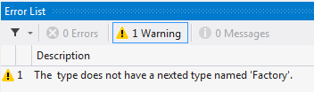
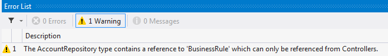

# Developing Custom Architectural Constraints

When you are creating your applications it is common to adopt custom design patterns that must be respected across all modules. Custom design patterns have the same benefits as standard ones, but they are specific to your application. For instance, the team could decide that every class derived from `BusinessRule` must have a nested class named `Factory`, derived from `BusinessRulesFactory`, with a public default constructor. 

Even performing line-by-line code reviews can miss violations of the pattern. Is there a better way to ensure that this doesn't happen? PostSharp offers the ability create custom architectural constraints. The constraints that you write are able to verify anything that you can query using reflection.

There are two kinds of constraints: *scalar constraints* and *referential constraints*. 

A scalar constraint applied on a declaration is checked when that declaration is compiled, so only in one assembly. Scalar constraints typically validate a type, member or parameter.

A referential constraint applied on a declaration is checked potentially many times, once for the assembly where that declaration is, and once for each assembly that uses (references) that declaration. Referential constraints typically validate the *usage* of a type, member or parameter. 


## Creating a scalar constraint

Let's start with a scalar constraint and create a constraint that verifies the first condition of our `BusinessRule` design pattern: that any class derived from `BusinessRule` must have a nested class named `Factory`. We can model this condition as a scalar constraint that applies to any class derived from `BusinessRule`. Therefore, we will create a type-level scalar constraint, apply it to the `BusinessRule` class, and use attribute inheritance to have the constraint automatically applied to all derived classes. 


### 

1. Create a class that inherits from the <xref:PostSharp.Constraints.ScalarConstraint> class in PostSharp. 

    ```csharp
    using System; 
    public class BusinessRulePatternValidation : ScalarConstraint 
    { 
    }
    ```


2. Designate what code construct type this validation aspect should work for by adding the <xref:PostSharp.Extensibility.MulticastAttributeUsageAttribute> attribute. In this case, we want the validation to occur on types only, and we want to enable inheritance. Using <xref:PostSharp.Extensibility.Strict> means that `BusinessRulePatternValidation` is applied not only on the class it annotates but also on all of its subclasses, even in other assemblies. 

    ```csharp
    [MulticastAttributeUsage(MulticastTargets.Class, Inheritance = MulticastInheritance.Strict)] 
    public class BusinessRulePatternValidation : ScalarConstraint 
    { 
    }
    ```


3. Override the <xref:PostSharp.Constraints.ScalarConstraint.ValidateCode(System.Object)> method. 

    ```csharp
    [MulticastAttributeUsage(MulticastTargets.Class, Inheritance = MulticastInheritance.Strict)] 
    public class BusinessRulePatternValidation : ScalarConstraint 
    { 
        public override void ValidateCode(object target) 
        { 
        } 
    }
    ```


4. Create a rule that checks that there's a nested type called `Factory`. You'll note that the `target` parameter for the <xref:PostSharp.Constraints.ScalarConstraint.ValidateCode(System.Object)> method is an `object` type. Depending on which target type you declare in the <xref:PostSharp.Extensibility.MulticastAttributeUsageAttribute> attribute, the value passed through this parameter will change. For `MulticastTargets.Class` the type passed is `Type`. To make use of the target for validation you must cast to that type first. 

    ```csharp
    [MulticastAttributeUsage(MulticastTargets.Class, Inheritance = MulticastInheritance.Strict)] 
    public class BusinessRulePatternValidation : ScalarConstraint 
    { 
        public override void ValidateCode(object target) 
        { 
            var targetType = (Type) target; 
     
            if ( targetType.GetNestedType("Factory") == null ) 
            { 
               // warning 
            } 
        } 
    }
    ```

    > [!NOTE]
    > Valid types for the `target` parameter of the <xref:PostSharp.Constraints.ScalarConstraint.ValidateCode(System.Object)> method include `Assembly`, `Type`, `MethodInfo`, `ConstructorInfo`, `PropertyInfo`, `EventInfo`, `FieldInfo`, and `ParameterInfo`. 


5. Write a warning about the rule being broken to the Output window in Visual Studio.

    ```csharp
    [MulticastAttributeUsage(MulticastTargets.Class, Inheritance = MulticastInheritance.Strict)] 
    public class BusinessRulePatternValidation : ScalarConstraint 
    { 
        public override void ValidateCode(object target) 
        { 
            var targetType = (Type)target; 
     
            if (targetType.GetNestedType("Factory") == null) 
            { 
                Message.Write( 
                    targetType, SeverityType.Warning, 
                    "2001", 
                    "The {0} type does not have a nested type named 'Factory'.", 
                    targetType.DeclaringType, 
                     targetType.Name); 
            } 
        } 
    }
    ```


6. Attach the rule to the code that needs to be protected. For this example we want to add this rule to the `BusinessRule` class. 

    ```csharp
    [BusinessRulePatternValidation] 
    public class BusinessRule 
    { 
        // No Factory class can be here or in any subclass of BusinessRule.
    }
    ```

    > [!NOTE]
    > This example shows applying the constraint to only one class. If you want to apply a constraint to large portions of your codebase, read the section on <xref:attribute-multicasting> 


7. Now if you compile the project you will see a warning in the Output window of Visual Studio when you run a build.

    

    > [!NOTE]
    > Due to a bug, the error code may not be shown in the Error list.


8. In some circumstances you may determine that a warning isn't aggressive enough. We can alter the rule that you have created so that it outputs a compile time error instead. All that you need to do is change the <xref:PostSharp.Extensibility.SeverityType> in the `Message.Write` to `Error`. 

    ```csharp
    [MulticastAttributeUsage(MulticastTargets.Class, Inheritance = MulticastInheritance.Strict)] 
    public class BusinessRulePatternValidation : ScalarConstraint 
    { 
        public override void ValidateCode(object target) 
        { 
            var targetType = (Type)target; 
     
            if (targetType.GetNestedType("Factory") == null) 
            { 
                Message.Write( 
                targetType, SeverityType.Error, 
                "2001", 
                "The {0} type does not have a nested type named 'Factory'.", 
                targetType.DeclaringType, 
                targetType.Name); 
            } 
        } 
    }
    ```

    


Using this technique it is possible to create rules or restrictions based on a number of different criteria and implement validation for several design patterns.

When you are working on projects you need to ensure that they adhere to the ideals and principles that your project teams hold dear. As with any process in software development, manual verification is guaranteed to fail at some point in time. As you do in other areas of the development process, you should look to automate the verification and enforcement of your ideals. The ability to create custom architectural constraints provides both the flexibility and verification that you need to achieve this goal.


## Creating a referential constraint

Now let's create a referential constraint that verifies the second condition our `BusinessRule` design pattern: that the `BusinessRule` class can only be used in the `Controllers` namespace. You can model this condition as a referential constraint. 


### 

1. Create a class that inherits from the <xref:PostSharp.Constraints.ReferentialConstraint> class in PostSharp. 

    ```csharp
    public class BusinessRuleUseValidation : ReferentialConstraint 
    { 
    }
    ```


2. Declare that this aspect should work only on types by adding the <xref:PostSharp.Extensibility.MulticastAttributeUsageAttribute> attribute to the class. We will apply this class to `BusinessRule` so that we prevent all code in our project from using `BusinessRule` or its subclasses, unless the code is in the Controllers namespace. 

    ```csharp
    [MulticastAttributeUsage(MulticastTargets.Class, Inheritance = MulticastInheritance.Strict)] 
    public class BusinessRuleUseValidation : ReferentialConstraint 
    { 
    }
    ```


3. Override the <xref:PostSharp.Constraints.ReferentialConstraint.ValidateCode(System.Object,System.Reflection.Assembly)> method. The target, in this case, is the BusinessRule class or one of its subclasses. The assembly is the assembly where we are currently looking for violators. 

    ```csharp
    [MulticastAttributeUsage(MulticastTargets.Class, Inheritance = MulticastInheritance.Strict)] 
    BusinessRuleUseValidation : ReferentialConstraint 
    { 
        public override void ValidateCode(object target, Assembly assembly) 
        { 
        } 
    }
    ```


4. Create the rule that checks for the use of the default constructor of the `BusinessRule` type in all code. 

    ```csharp
    [MulticastAttributeUsage(MulticastTargets.Class, Inheritance = MulticastInheritance.Strict)] 
    public class BusinessRuleUseValidation : ReferentialConstraint 
    { 
        public override void ValidateCode(object target, Assembly assembly) 
        { 
            var targetType = (Type) target; 
            var usages = ReflectionSearch 
                    .GetMethodsUsingDeclaration(targetType.GetConstructor(new Type[0]));
     
            foreach (MethodUsageCodeReference methodUsageCodeReference in usages)
            {
                if (!methodUsageCodeReference.UsingMethod.DeclaringType.Namespace.Contains("Controllers"))
                {
                    // warning
                }
            }
        }
    }
    ```

    > [!NOTE]
    > The rule here makes use of the <xref:PostSharp.Reflection.ReflectionSearch> helper class that is provided by the PostSharp framework. This class, along with others, is an extension to the built in reflection functionality of .NET and can be used outside of aspects as well. The method <xref:PostSharp.Reflection.ReflectionSearch.GetMethodsUsingDeclaration(System.Reflection.MemberInfo)> looks in the current assembly already so we don't need to use the `assembly` parameter to `ValidateCode`. 


5. Write a warning message to be included in the Output window of Visual Studio.

    ```csharp
    [MulticastAttributeUsage(MulticastTargets.Class, Inheritance = MulticastInheritance.Strict)] 
    public class BusinessRuleUseValidation : ReferentialConstraint 
    { 
        public override void ValidateCode(object target, Assembly assembly) 
        { 
            var targetType = (Type) target; 
            var usages = ReflectionSearch 
                    .GetMethodsUsingDeclaration(targetType.GetConstructor(new Type[0]));
     
            foreach (MethodUsageCodeReference methodUsageCodeReference in usages)
            {
                if (!methodUsageCodeReference.UsingMethod.DeclaringType.Namespace.Contains("Controllers"))
                {
                    Message.Write( 
                        targetType, SeverityType.Warning,  
                        "2002", 
                        "The {0} type contains a reference to '{1}' which can only be referenced from Controllers.",
                        methodUsageCodeReference.UsingMethod.DeclaringType,
                        target);
                }
            }
        }
    }
    ```


6. Attach the referential constraint to the BusinessRule class. In this example, add an attribute to the `AccountRepository` class. 

    ```csharp
    [BusinessRuleUseValidation] 
    public class BusinessRule 
    { 
        // Now, only code in the Controllers namespace can call this class's constructor.
    }
    ```


7. Test the rule by adding nonconforming code to your project.

    ```csharp
    namespace PostSharp.Architecture.Repositories 
    { 
        public class AccountRepository 
        { 
            public void AddAccount(string name) 
            { 
                var businessRule = new BusinessRule(); 
                businessRule.DoStuff(); 
            } 
        } 
    }
    ```


8. Now when you compile the project you will see a warning in the Output window in Visual Studio.

    

    > [!NOTE]
    > If using a warning isn't aggressive enough you can change the <xref:PostSharp.Extensibility.SeverityType> to `Error`. Now when the rule is broken an error will appear in the Output window of Visual Studio and the build will not be successful. 


> [!CAUTION]
> PostSharp constraints operate at the lowest level. For instance, checking relationships of a type with the rest of the code does not implicitly check the relationships of the methods of this type. Also, checking relationships of namespaces is not possible.
Custom attribute multicasting can be used to apply a constraint to a large number of types, for instance all types of a namespace. But this would result in one constraint instance for every type, method and field on this namespace. Although this has no impact on run time, it could severely affect build time. For this reason, the current version of PostSharp Constraints is not suitable to check isolation (layering) of namespaces at large scale.

Referential constraints provide you with the ability to declare architectural design patterns right in your code. By documenting these patterns right in the codebase you are able to provide easy access for the development team as well as continual verification that your desired design patterns are being adhered to.


## Validating the constraint itself

Now that you have created scalar and referential constraints you can be assured that certain architectural rules are being consistently implemented in your codebase. There is one thing that is missing though.

With what you have done thus far, it is possible to attach your architectural constraints to any code element in your projects. This may not be appropriate. For example, the scalar constraint that you created to perform the `BusinessRulePatternValidation` may be a valid constraint only on classes that exist in the `Models` namespace. 

Let's look at how we can ensure that this constraint is only enforced on classes that exist in the `Models` namespace. 


### 

1. Open the `BusinessRulePatternValidation` class that you created earlier. 


2. Override the <xref:PostSharp.Constraints.Constraint.ValidateConstraint(System.Object)> method. 


3. Write the validation logic to ensure that this constraint is only applied to classes in the `Models` namespace. 

    > [!NOTE]
    > When the <xref:PostSharp.Constraints.Constraint.ValidateConstraint(System.Object)> method returns `true`, it tells PostSharp that the constraint should be applied to that target code element. When the <xref:PostSharp.Constraints.Constraint.ValidateConstraint(System.Object)> method returns `false` PostSharp will not apply the constraint to the target code element. 


Now, when the `BusinessRulePatternValidation` attribute is applied to a class that is not in the `Models` namespace of your project, there will be no warning or error added to the Visual Studio Output window. 

When the attribute is applied to a class in the `Models` namespace and that class doesn't pass the constraint's rules you will continue to see the warning or error indicating this architectural failure. 

## See Also

**Reference**

<xref:PostSharp.Extensibility.MulticastAttributeUsageAttribute>
<br><xref:PostSharp.Constraints.ScalarConstraint>
<br><xref:PostSharp.IgnoreWarningAttribute>
<br><xref:PostSharp.IgnoreWarningAttribute.MessageId>
<br><xref:PostSharp.IgnoreWarningAttribute.Reason>
<br><xref:PostSharp.Extensibility.MulticastAttributeUsageAttribute>
<br>**Other Resources**

<xref:attribute-multicasting>
<br><xref:multicast-inheritance>
<br>