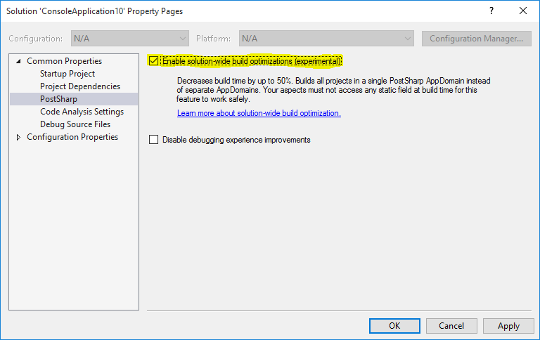

> [!IMPORTANT]
> This feature is temporarily disabled.

By default, PostSharp processes each project in its own AppDomain. The overhead of creating a new AppDomain for each project is quite large: not the new AppDomain has to be loaded, but all assembly references need to be loaded and indexed over and over again.

This overhead can be dramatically reduced by enabling *solution-wide build*. When this option is enabled, PostSharp will reuse the AppDomains as much as possible. By enabling solution-wide build, you can make PostSharp 1.5 to 2 times faster. 

## Differences of solution-wide build

Before you enable solution-wide build, you should check that your custom aspects do not depend on characteristics that differ between the default (project-wide) build and the solution-wide build. These differences are the following:

* Static variables are shared between several projects instead of being local to a single project. Make sure that the build-time logic of your aspect does not store information in static fields. Replace static fields with accesses to `PostSharpEnvironment.CurrentProject.StateStore`, which provides a project-scoped state store. See <xref:PostSharp.Extensibility.IProject.StateStore> and <xref:PostSharp.Extensibility.IStateStore> for details. 

* When you reflect dependent assemblies using System.Reflection, you may *randomly* get the pre-PostSharp or post-PostSharp binary assembly. Do not rely on the fact that you get any of these variants of the assembly. 

* Assembly binding redirections are computed for the whole solution (or sub-solution) instead of the sole project. For a specific project, it can happen that you will get a higher version of a reference assembly in solution-wide build than in project-wide build.

> [!CAUTION]
> The set of projects processed in the same AppDomain and the order of processing should be considered random.

## Enabling solution-wide build

> [!CAUTION]
> Solution-wide build is an experimental feature. If it does not work for you, please report the issue to PostSharp support and disable the feature.

### To enable solution-wide build for a solution:

1. In Solution Explorer, right-click on the solution node, and select **Properties**. 

2. Select the **PostSharp** tab under **Common Properties**. 

3. Check the check box **Enable solution-wide build optimizations**. 

    

As a result, PostSharp will attempt to reuse AppDomains when building this solution from Visual Studio. The setting is stored in a file named *MySolution.pssln* in the same directory as *MySolution.sln*. 

> [!NOTE]
> Solution-wide build only works when the build is triggered by Visual Studio. Command-line builds are not affected.

> [!TIP]
> PostSharp needs to create at least one AppDomain per specific version of the target framework. To optimize the AppDomain reuse and therefore build time, make sure to consolidate the target framework versions of your projects.

