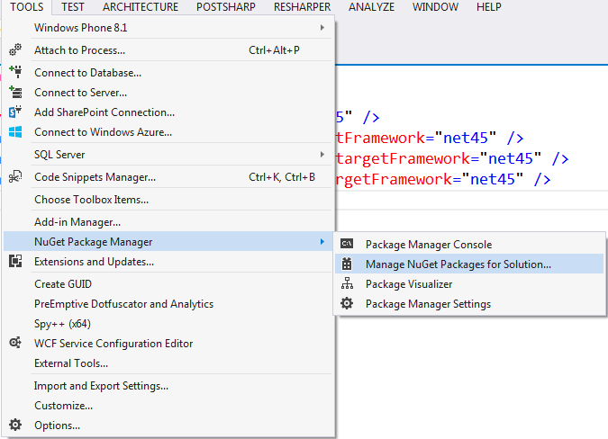
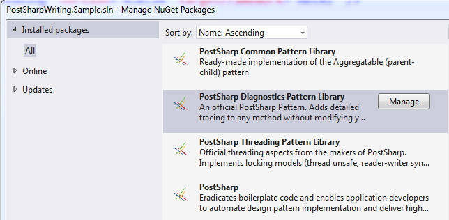
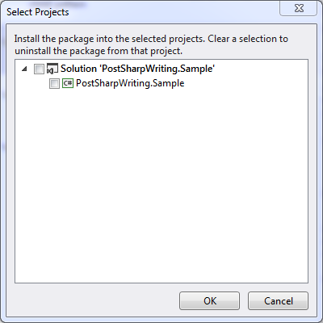
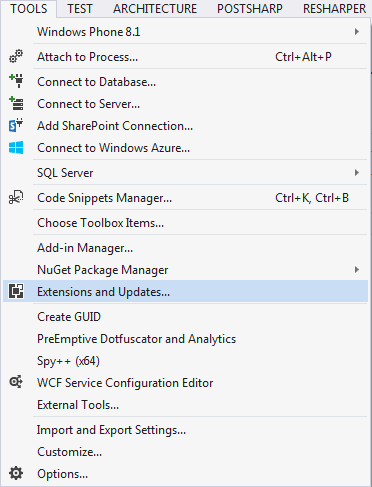
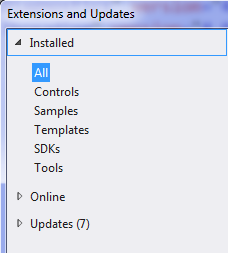
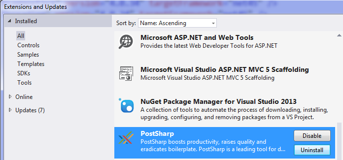
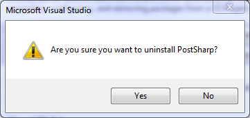
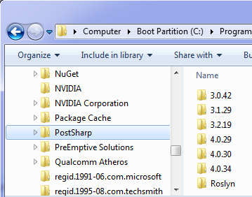

# Uninstalling PostSharp

If you make the decision to remove PostSharp from your project we are sorry to see you leave.

There are two scenarios you may want to consider: removing PostSharp from individual projects or solutions, and removing PostSharp from Visual Studio.

## Removing PostSharp from your projects and solutions

Here are some steps to follow to remove PostSharp from your project.

> [!WARNING]
> As you'll see in these steps, removing the product from your project is not that difficult. However, replacing the aspects that you were using will be a much more arduous task that will require a great deal of planning.
You will need to replace the aspects by handwritten source code that implement the same behaviors. Depending on how intensively you used PostSharp, your codebase could significantly increase as a result of stopping using PostSharp. Other products and frameworks that pretend to implement aspect-oriented programming actually only provide a small subset of the features you are got used to with PostSharp.
Because every project will use aspects differently, and some will have custom aspects, we are unable to provide you with any generic piece of advice about how to replace specific aspects.

To remove PostSharp from a project, you simply have to remove all PostSharp packages from it. The following procedure demonstrates how to remove PostSharp for the whole solution.

### Removing PostSharp with NuGet Packages Manager for Solution

1. Open the Package Manager for Solution windows

    

2. Select the All tab from the left side of the window.

    

3. Find the PostSharp packages in the list and select one of the PostSharp Library packages. Click the Manage button.

    

    > [!NOTE]
    > Start by selecting the PostSharp Library Packages and working in reverse dependency order. This will result in the main PostSharp package being the last one that you select to remove.

4. Ensure that you uncheck all of the projects listed in the window and click OK.

    

5. Repeat steps 3 and 4 for each of the PostSharp packages that show in the Packages Manager for Solution window.

6. To verify that all of the PostSharp packages have been removed from your codebase, ensure that there are no PostSharp packages listed in the Packages Manager for Solution window.

Once you have removed all of the PostSharp packages from your codebase it is most probable that your application will no longer compile. Compilation errors will be registered where PostSharp aspect attributes exist in the codebase as well as where custom aspects were written. You will need to remove these entries from your codebase to get it to compile again.

Simply deleting the offending code can accomplish this. You must remember that in the process of removing PostSharp from your codebase these errors indicate locations where you are removing functionality from the codebase as well. If the functionality that is being removed is required by the application you will need to determine how to provide that functionality in the codebase going forward. This is the most difficult part of removing PostSharp from your codebase. Because aspects can be used in a multitude of different manners, and custom aspects can be created for any number of different uses, there is no practical way to tell you how to replace the functionality being lost.

> [!NOTE]
> You now have removed PostSharp from your codebase. At this point, you are able to continue on your development effort without making use of PostSharp.
If you would like to remove PostSharp from Visual Studio, proceed with the following steps.

## Cleaning Your System

## Removing PostSharp from Visual Studio

First, remove the PostSharp extension from Visual Studio.

### Uninstalling the PostSharp Tools for Visual Studio

1. Open the Extensions and Updates window.

    

2. Select the All tab on the left of the window.

    

3. Find the **PostSharp** entry, select it and click the **Uninstall** button. 

    

4. Click **Yes** to confirm that you want to uninstall the PostSharp extension. 

    

5. Restart Visual Studio.

Then you can remove the temporary files created by PostSharp. These files would be recreated as necessary the next time you run PostSharp.

Other than occupying disk space, there is no impact of not removing these files.

### Cleaning temporary files

1. Open Windows Explorer and navigate to *C:\ProgramData\PostSharp*. 

    

2. Select the *C:\ProgramData\PostSharp* folder and delete it. 

