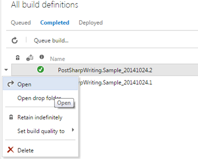
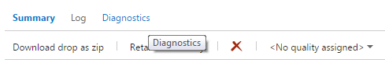
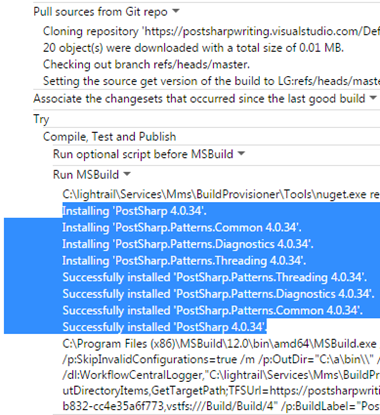

# Using PostSharp with Visual Studio Online

When hosting your source code on Visual Studio Online, adding PostSharp to the codebase is no different than for any other build server situation.

Visual Studio Online offers an online build server environment. Once configured the build server will retrieve your source code and compile the application for you. As part of this build process, you will want any PostSharp aspects to be added in the same way that it occurs on your local development machine. To do this you will have to ensure that your codebase includes PostSharp as outlined in the <xref:install-compiler> section. You will also need to configure a build definition as outlined in the [Create or edit build definition](http://msdn.microsoft.com/en-us/library/ms181716.aspx) article on MSDN. 

Once you are able to successfully run the build you will want to review the build logs and verify the artifacts that were created by that build. Here's how you can verify that your build included your PostSharp aspects.

### Verifying Visual Studio Online Builds

1. To review the build logs, open the successful build.

    

2. Select the Diagnostics tab.

    

3. Ensure that the installation of PostSharp and any PostSharp patterns libraries that you used.

    

    If you see entries like these in your build log you know that the build process correctly downloaded the PostSharp components.

    If you do not see any entries for the downloading of the PostSharp components you will want to ensure that the packages.config file is correctly included in your source code repository and that the PostSharp dependencies are referenced in the appropriate projects.

## See Also

**Other Resources**

[MSDN: Create or edit Visual Studio Online build definition](http://msdn.microsoft.com/en-us/library/ms181716.aspx)
 