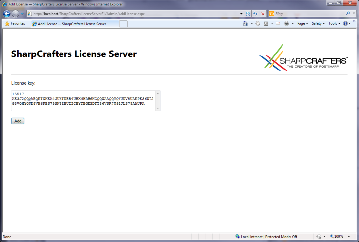
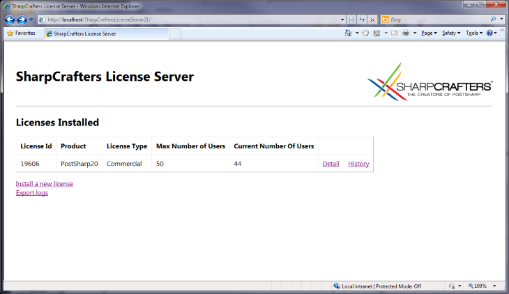
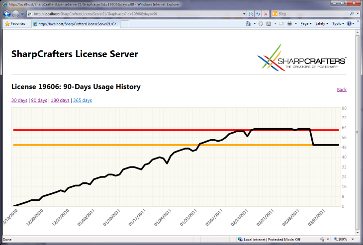

# Installing and Servicing PostSharp License Server

This topic covers PostSharp License Server from the point of view of the system administrator and license administrator.

We designed our license server to help our customers, not to enforce our license agreements. The application is open-source, it uses a clear SQL database and provides the ability to workaround issues by canceling leases or purging tables.


## Disclaimer

Using the license server is optional. Only a few enterprise customers chose to use it. Alternative approaches are:

* To rely on the default license audit mechanism (see <xref:license-audit> for details). 

* To acquire enough licenses for the whole team with some reserve margin.

* To use a spreadsheet to keep track of who is using the software.

* To use other software audit products, although this approach is imperfect because PostSharp is not installed on the developer's machine as a standalone and indentifiable application.


## Design Principles

The license server manages leases of a license to a given user on a given machine (the “client”). Once the lease is provided to the client, it is cached on the client. Upon client request, the server will return a license key and two dates: the lease end date and the lease renewal date. The lengths of the lease and of the renewal period are configurable. The client will not contact the license server before the renewal date, so the client can go offline during the duration of the lease. Then, a new lease will be reserved for the client. If the client is not able to renew its lease from the server after the lease renewal date, the client will still be able to use PostSharp until the end of the lease. Then, the use of PostSharp will be prevented. To avoid loss of productivity due to lack of network connection or server outages, we recommend setting a large delay between the lease renewal period and the lease period.

If the number of concurrent users exceeds the licensed number, the license administrator will receive an email, and additional users will be allowed during a grace period. At the end of the grace period, only the licensed number of concurrent users will be allowed. The duration of the grace period and the number of excess users depend on the kind of license. By default, it is set to 30% of users and 30 days.

> [!IMPORTANT]
> If you have subscribed to a license server, you will need periodic connections to the company network. The licensing client will automatically try to renew a lease when it comes close to expiration and if the license server is available. Lease duration and renewal settings can be configured by the administrator of the license server. A connection to the license server is not necessary while the lease is valid.


## System Requirements

PostSharp License Server is an ASP.NET 4.5 application backed by a Microsoft SQL database.

It requires:

* Windows Server 2003 or later with Internet Information Services installed.

* Microsoft SQL Server 2005 or later (any edition, including the Express edition).

If the license server can be configured with a sufficiently long lease renewal period, there is no need to deploy the application and its database in high-availability conditions. You need to plan that the amount of time between the lease renewal and the lease end is larger than the longest expected outage. Frequent backups are not critical unless usage information is required for accounting purposes in case of pay-as-you-use licenses, where the **Export Logs** feature is required. 

> [!WARNING]
> Deploying the ASP.NET application to several machines is not supported because the lease algorithm uses application locking instead of database locking.


## Installing PostSharp License Server

The setup procedure is simple but must be performed manually.

To install PostSharp License Server, you will need administrative access on a Windows Server machine and the permission to create a new database.


### To install PostSharp License Server:

1. Download the latest version of PostSharp License Server from [GitHub](https://github.com/postsharp/PostSharp.LicenseServer/releases). 

    > [!NOTE]
    > It is not necessary that the version of PostSharp License Server exactly matches the version of PostSharp. You do not have to upgrade PostSharp License Server as long as the license keys you want to use are compatible with the server version.


2. Using Internet Information Services (IIS) Manager, configure a new web application whose root is the folder containing the file *web.config*. 


3. The application pool should be configured to use ASP.NET 4.5.


4. Configure the authentication mode of the web application: disable **Anonymous Authentication**, and enable **Windows Authentication**. 


5. Create an MS SQL database (the free MS SQL Express server is supported).


6. Execute the script *CreateTables.sql* in the context of this database. The file is located in the zip archive of the license server. 


7. Set up the security on this database so that the user account under which the ASP.NET application pool is running (typically NETWORK SERVICE) can access the database.


8. Edit the file *web.config*: 

    a. `configuration/connectionStrings`: Correct the connection string (server name and database name) to match your settings. 

    b. `configuration/system.net/mailSettings`: Set the name of the SMTP server used to send warning emails. 

    c. `configuration/applicationSettings`: this section contains several settings that are documented inside the *web.config* file. The most important settings are the email addresses for shortage notifications and the duration of leases duration and renewal delay. 

    d. `configuration/system.web/authorization`: Set up the security of the whole application to restrict the persons who are allowed to borrow a license. Optional. 

    e. `configuration/location[@path='Admin']/system.web/authorization`: Specify who has access to the administrative interface of the application. Optional. 


## Installing a license key

Before developers can start using the license server, you need to install a license key.


### To install a license key into the license server:

1. Open the home page of the license server using a web browser.


2. Click on the link **Install a new license**. 


3. Paste the license key and click on button **Add**. 

    


## Testing the license server

If you have installed the license server at the address *http://localhost/PostSharpLicenseServer*, you can test it opening the URL *http://localhost/PostSharpLicenseServer/Lease.ashx?product=PostSharp30&user=me&machine=other* using Firefox or Chrome. If the license acquisition was successful, the browser will display the license key and the duration of the lease. You can also then see the resulting allocation on the home page *http://localhost/PostSharpLicenseServer*, and cancel the lease. 


## Displaying license usage

PostSharp License Server makes it easy to know how many people are currently using the product, and to display historical data.







## Canceling leases

You can cancel a lease from the lease list by clicking on the **Cancel** hyperlink. Note that canceling a lease on the server does not cancel the lease on the client. It is not possible to cancel leases on the client. 


## Maintenance

The license server is designed to keep a history of all leases. Therefore, it can grow indefinitely, depending on the number of users and lease duration. It is safe to delete all records from the `Lease` table at any time unless these records are necessary for accounting purposes. 

Using SQL Agent, you can schedule a job that purges old records of the `Lease` table: 

```sql
DELETE FROM [dbo].[Leases] WHERE EndTime < DATEADD( day, -90, GETDATE() );
```

