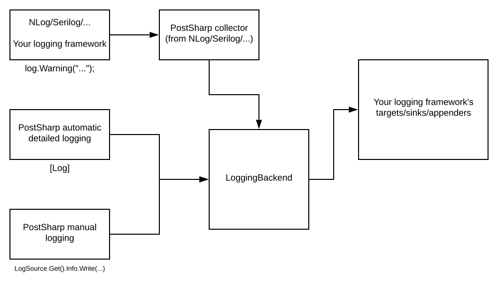

# Collecting Logs from Other Frameworks

This section describes how you can use your existing logging with PostSharp by collecting events from your logging framework and channeling them through the PostSharp pipeline so that both PostSharp detailed logging and your manual log message appear cohesively in the same output.

PostSharp Logging functions correctly even without collecting. The main benefits of collecting logs are:

* automatic indentation based on the call stack for manual logging,

* unification of message templates across detailed and manual logging,

* no need to rewrite your old logging code even if you are now using PostSharp Logging with a different target logging framework.


## PostSharp Logging without collecting logs

There are three ways to log messages to the output:

* Automatic detailed logging, such as with the <xref:PostSharp.Patterns.Diagnostics.LogAttribute>. 

* Manual logging using the PostSharp <xref:PostSharp.Patterns.Diagnostics.LogSource>. 

* Manual logging using your logging framework

Automatic detailed logging and <xref:PostSharp.Patterns.Diagnostics.LogSource> use the PostSharp pipeline. This means that they are sent to the same configurable PostSharp logging backend and share the same indentation level. The logging backend then sends both kinds of events to your logging framework. From there, they are sent to the final output, such as a file or the console. 

If you instead use manual logging provided by your logging framework alongside PostSharp, that manual logging will bypass the PostSharp pipeline and will be sent to the final output directly. It will not benefit from indentation maintained by PostSharp and will not use configuration set up in the logging backend.

This situation is described in the following diagram:


For example, take the following method. Assume `logger` is an NLog logger, but the situation is similar for other logging frameworks. 

```csharp
[Log]
public void MyMethod1()
{
    logger.Info( "Manual." );
}
```

It may produce something like the following output:

```text
DEBUG|MyNamespace1.MyClass1|MyClass1.MyMethod1()|Starting.
INFO |MyNamespace1.MyClass1|Manual.
DEBUG|MyNamespace1.MyClass1|MyClass1.MyMethod1()|Succeeded.
```

That is fine but it doesn't make use of context and configuration in the PostSharp logging backend. One consequence is that the line with "Manual." isn't indented, despite being inside `MyMethod1`. Another consequence is that it doesn't include the logger name. 


## PostSharp Logging with log collecting

If you use log collecting, then logging events that you create with your logging framework are sent to a special PostSharp target/sink/appender (terminology varies between logging frameworks). This target collects the logging events and sends them through the PostSharp pipeline to your logging backend. This would usually be the backend for your logging framework, but it could be any logging backend in principle. The logging backend sends the transformed events to the final output using the targets/sinks/appenders you specify for your logging framework.

This situation is described in the following diagram:



If we use log collecting, then the `Method1` from the previous section actually produces the following output: 

```text
DEBUG|MyNamespace1.MyClass1|MyClass1.MyMethod1()|Starting.
INFO |MyNamespace1.MyClass1|  MyNamespace1.MyClass1|Manual.
DEBUG|MyNamespace1.MyClass1|MyClass1.MyMethod1()|Succeeded.
```

It now has indentation and because the class name is now part of the message itself for both automatic and manual logging, you can now remove the logger name from the NLog formatting string and end up with a cleaner output:

```text
DEBUG|MyClass1.MyMethod1()|Starting.
INFO |  MyNamespace1.MyClass1|Manual.
DEBUG|MyClass1.MyMethod1()|Succeeded.
```

The way to set up log collecting is different for each supported logging framework. We support log collecting from Serilog, log4net, Microsoft Logging (ASP.NET Core), NLog, Trace and TraceSource. See our documentation page for each logging framework for instructions on how to set up log collecting.

## See Also

**Other Resources**

<xref:nlog>
<br><xref:logging-trace>
<br><xref:logging-tracesource>
<br><xref:logging-aspnetcore>
<br><xref:serilog>
<br><xref:log4net>
<br>