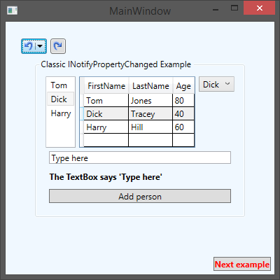
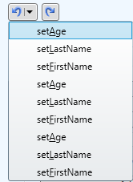

# Adding Undo/Redo to the User Interface

The Undo/Redo functionality that you added to your codebase needs to be made available to the users. Users will want to have the ability to move forward and backward through the stack of recorded operations.


## Using the ready-made WPF controls

PostSharp includes two button controls <xref:PostSharp.Patterns.Xaml.UndoButton> and <xref:PostSharp.Patterns.Xaml.RedoButton> that you can add to your application. 


### To add Undo/Redo to a WPF window:

1. Install the *PostSharp.Patterns.Xaml* package using NuGet. 


2. Add the following namespace declaration to the root element of your XAML file:

    ```csharp
    xmlns:model="clr-namespace:PostSharp.Patterns.Model.Controls;assembly=PostSharp.Patterns.Xaml"
    ```


3. To add Undo and Redo buttons to the user interface, including the following two lines of XAML.

    ```csharp
    <model:UndoButton HorizontalAlignment="Left" Margin="22,24,0,0" VerticalAlignment="Top" />
    <model:RedoButton HorizontalAlignment="Left" Margin="64,24,0,0" VerticalAlignment="Top"/>
    ```

    

    Your users are now able to make a changes in the user interface and Undo and/or Redo those changes at any point that they want.


## Clearing the initial history

If we were to open the Customer management screen you would notice that the Undo button has a number of actions listed under it.



Those actions are listing the changes that were taken when the different `Person` instances were loaded and their properties were set. Most users will only want to see actions that they have manually taken in the screen. As such, you will need to manually interact with the <xref:PostSharp.Patterns.Recording.Recorder> to ensure that the Undo button list is empty when the window opens. 

To provide an empty list of recorded actions when the window is initially opened, open the `ViewModelMain` class and find the constructor. Add the following as the last line in the constructor: 

```csharp
RecordingServices.DefaultRecorder.Clear();
```

The <xref:PostSharp.Patterns.Recording.Recorder> class is accessed through the <xref:PostSharp.Patterns.Recording.RecordingServices.DefaultRecorder> property. This property contains the current <xref:PostSharp.Patterns.Recording.Recorder> instance that is being used by the <xref:PostSharp.Patterns.Recording.RecordableAttribute> aspect. The <xref:PostSharp.Patterns.Recording.Recorder> class has two collections, <xref:PostSharp.Patterns.Recording.Recorder.UndoOperations> and <xref:PostSharp.Patterns.Recording.Recorder.RedoOperations>, which contain all of the past operations that can be undone and redone. The <xref:PostSharp.Patterns.Recording.Recorder.Clear> method removes all operations from both of those collections. 

Now when you open the Customer management screen both the Undo and Redo buttons will show no history. This is the simplest type of Undo/Redo implementation that you can do. It will record each property change operation separately in the Undo and Redo UI buttons which probably isn’t what you, or your users, will want to see. Read <xref:undoredo-operation-name> to learn how to record groupings of operations that make sense to your business users. 


## Creating custom undo/redo controls

If the buttons provided by PostSharp don't meet your requirements, you can create your own controls for WPF, Windows Phone, WinRT, or any other platform.

Custom controls will typically provide a front-end to the global <xref:PostSharp.Patterns.Recording.Recorder> exposed by the <xref:PostSharp.Patterns.Recording.RecordingServices.DefaultRecorder> property. The controls could show the contents of the <xref:PostSharp.Patterns.Recording.Recorder.UndoOperations> and <xref:PostSharp.Patterns.Recording.Recorder.RedoOperations> collections. Controls typically use the <xref:PostSharp.Patterns.Recording.Recorder.Undo> and <xref:PostSharp.Patterns.Recording.Recorder.Redo> methods. 

