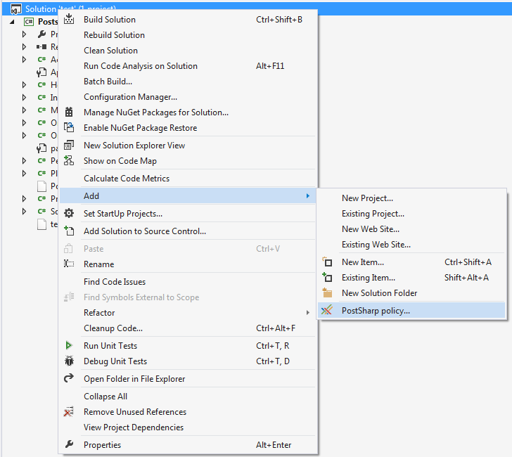
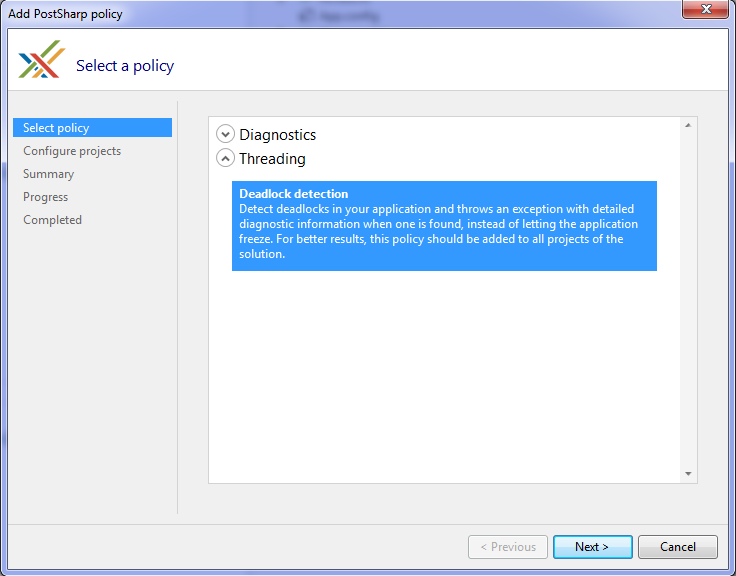
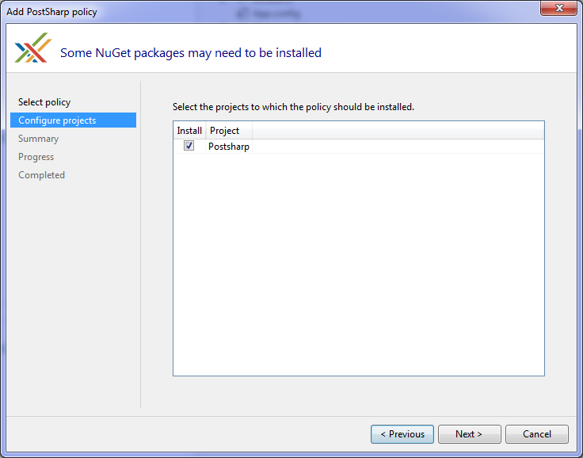
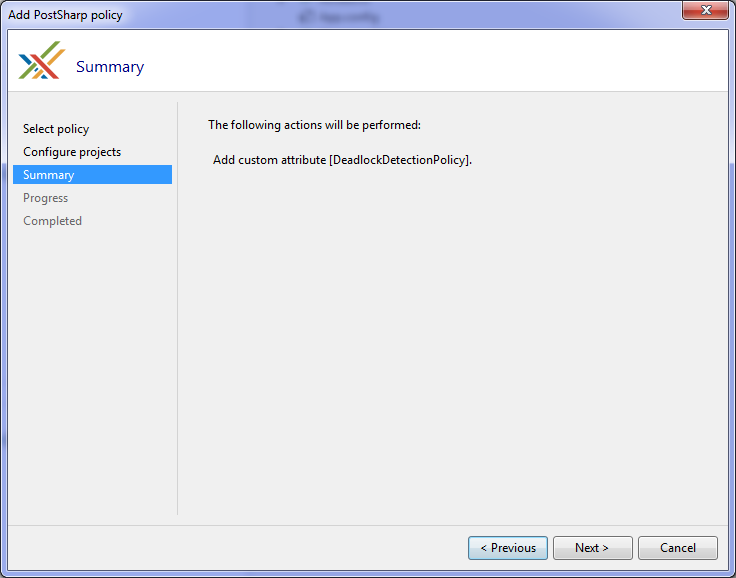
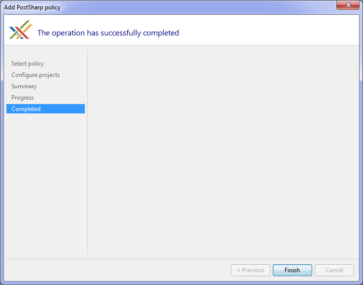
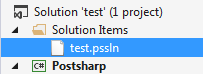
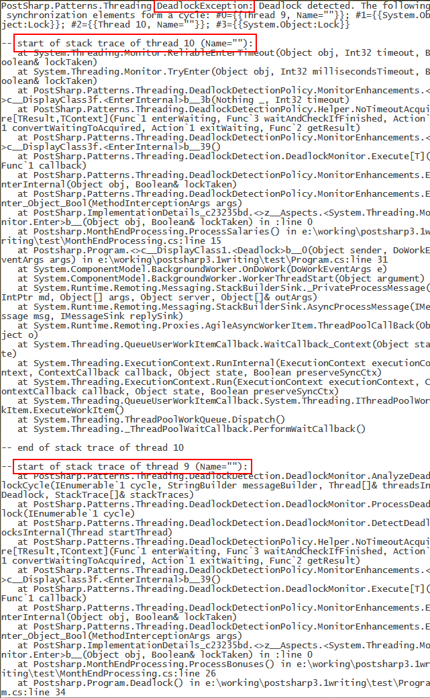

# Detecting Deadlocks at Runtime

A common problem that is found in multithreaded code is that multiple threads enter a situation where they are waiting for each other to finish. This is a deadlock situation and neither thread will complete executing in this situation. Because the threads are waiting on each other, neither is capable of providing diagnostic information to aid in debugging the situation. The <xref:PostSharp.Patterns.Threading.DeadlockDetectionPolicy> helps provide this information. 


## Adding deadlock detection using PostSharp Tools for Visual Studio


### To apply the deadlock detection to your application with PostSharp Tools for Visual Studio:

1. Right click on your solution in Solution Explorer, select Add followed by PostSharp Policy...

    


2. In the Add PostSharp policy wizard, expand Threading and select Deadlock detection.

    


3. Select the projects that you would like to add deadlock detection to.

    > [!NOTE]
    > You will need to add this to every project in your application. Excluding projects could cause your application to fail.

    


4. Review the configuration that you have selected and click Next.

    


5. Close the wizard when the process had completed by clicking Finish.

    


The result of running this wizard is that a *pssln* file has been added to your project. 



The *pssln* file contains an entry that enables deadlock detection across all projects in your solution. 

```xml
<Project xmlns="http://schemas.postsharp.org/1.0/configuration" xmlns:t="clr-namespace:PostSharp.Patterns.Threading;assembly:PostSharp.Patterns.Threading">
  <Multicast>
    <t:DeadlockDetectionPolicy />
  </Multicast>
</Project>
```


## Manually adding deadlock detection to a project


### To manually add deadlock detection to a project:

1. Add the *PostSharp.Patterns.Threading* NuGet package to the project. 


2. Add the <xref:PostSharp.Patterns.Threading.DeadlockDetectionPolicy> custom attribute to in any C# file. We recommend you add it to a new file named *GlobalAspects.cs*. 

    ```csharp
    [assembly: DeadlockDetectionPolicy]
    ```

    > [!NOTE]
    > You will need to add this to every project in your application. Excluding projects could cause your application to fail.


## Manually adding deadlock detection to the whole solution

Adding deadlock detection at the solution level can also be done manually. This can be done by adding an entry to the *pssln* file in the solution. 


### To manually add deadlock detection to a solution:

1. Open the solution's *pssln* file. This can be found under the Solution Items folder in Visual Studio's Solution Explorer. 

    

    If the *pssln* file doesn't exist manually add the file at the solution level. Name the file with the same name as your solution and the *pssln* file extension. 


2. If you had to create the *pssln* file and add it to your solution add the following XML to it. If the *pssln* file already existed in your project proceed to the next step. 

    ```xml
    <?xml version="1.0" encoding="utf-8"?>
    <Project xmlns="http://schemas.postsharp.org/1.0/configuration" xmlns:t="clr-namespace:PostSharp.Patterns.Threading;assembly:PostSharp.Patterns.Threading">
    </Project>
    ```


3. Add a multicast attribute to the Project element that will add <xref:PostSharp.Patterns.Threading.DeadlockDetectionPolicy> to all the projects in the solution. 

    ```xml
    <?xml version="1.0" encoding="utf-8"?>
    <Project xmlns="http://schemas.postsharp.org/1.0/configuration" xmlns:t="clr-namespace:PostSharp.Patterns.Threading;assembly:PostSharp.Patterns.Threading">
      <Multicast>
        <t:DeadlockDetectionPolicy />
      </Multicast>
    </Project>
    ```


4. Add the *PostSharp.Patterns.Threading* NuGet package to all projects in the solution. 


Once you save the *pssln* file you will have added deadlock detection to all projects in your solution. 


## Deadlock detection

When a deadlock is detected a <xref:PostSharp.Patterns.Threading.DeadlockException> is thrown. The exception will include a detailed report of all the threads and locks involved in the deadlock. Here is an example of that. 



## See Also

**Reference**

<xref:PostSharp.Patterns.Threading.DeadlockDetectionPolicy>
<br><xref:PostSharp.Patterns.Threading.DeadlockException>
<br>**Other Resources**

<xref:thread-safety-policy>
<br><xref:PostSharp.Patterns.Threading.ThreadSafetyPolicy>
<br>