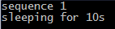
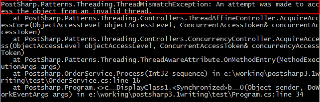

# Thread Affine Threading Model

One of the simplest ways to consider threading is to limit object instance access to the thread that created the instance. This is how the Thread Affine threading model works.


## Adding the Thread Affine model to a class


### To apply the Thread-Affine threading model to a class:

1. Add the *PostSharp.Patterns.Threading* package to your project. 


2. Add `using PostSharp.Patterns.Threading` namespace to your file. 


3. Add the <xref:PostSharp.Patterns.Threading.ThreadAffineAttribute> to the class. 


4. Annotate your object model for parent/child relationships as described in <xref:aggregatable-adding>. 


### Example

In the example below the <xref:PostSharp.Patterns.Threading.ThreadAffineAttribute> has been added to the class. 

```csharp
[ThreadAffine]
public class OrderService
{
    public void Process(int sequence)
    {
        Console.WriteLine("sequence {0}", sequence);
        Console.WriteLine("sleeping for 10s");
        
        Thread.Sleep(new TimeSpan(0,0,10));
    }
}
```


## Rules enforced by the Actor aspect


The <xref:PostSharp.Patterns.Threading.ThreadAffineAttribute> aspect does not verify your code at build-time. Instead, it injects code that enforces the model at run time. If it detects that the object is being accessed from a different thread than the one that created it, the aspect will throw a <xref:PostSharp.Patterns.Threading.ThreadMismatchException> exception. 

To test this the thread-affine `OrderService` class, we can run the following code: 

```csharp
public void Main()
{
    var orderService = new OrderService();
            
    orderService.Process(1);

    var backgroundWorker = new BackgroundWorker();
    backgroundWorker.DoWork += (sender, args) =>
    {
        try
        {
            orderService.Process(2);
        }
        catch (Exception ex)
        {
            Console.WriteLine(ex.ToString());
        }
    };
    backgroundWorker.RunWorkerAsync();  
}
```

The above code will execute the `orderService.Process(1)` method and output the following to the console. 



That code successfully executed because the `orderService` instance was both created (via the `new` keyword) and executed on the same thread. 

After the 10 second sleep period, a `BackgroundWorker` thread is opened and it is set to execute the `orderService.Process(2)` method. If an exception is thrown that will be output to the console. When this piece of code executes you will see the following console output. 



As you can see that a <xref:PostSharp.Patterns.Threading.ThreadMismatchException> exception was thrown. This happened because the `orderService` instance was created on the main thread and the `BackgroundWorker` thread attempted to execute it. Because the `OrderService` class has been marked with the <xref:PostSharp.Patterns.Threading.ThreadAffineAttribute> attribute only the thread that creates an instance of it can access that instance. 


## Working with object trees

Because the Thread-Affine model is an implementation of the Aggregatable pattern, all of the same behaviors of the <xref:PostSharp.Patterns.Model.AggregatableAttribute> are available. For more information regarding object trees, read <xref:aggregatable>. 

> [!NOTE]
> Once you have established your parent-child relationships you will need to apply compatible threading models to the child classes. You will want to refer to the <xref:threading-model-compatibility> article to determine which threading model will work for the children of the Thread-Affine object. 

## See Also

**Other Resources**

<xref:threading-model-compatibility>
<br>**Reference**

<xref:PostSharp.Patterns.Threading.ThreadAffineAttribute>
<br><xref:PostSharp.Patterns.Threading.ThreadMismatchException>
<br><xref:PostSharp.Patterns.Threading.PrivateThreadAwareAttribute>
<br><xref:PostSharp.Patterns.Model.ChildAttribute>
<br>