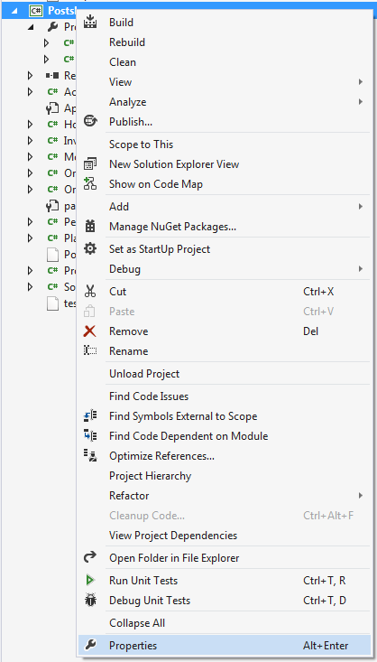
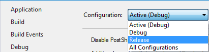
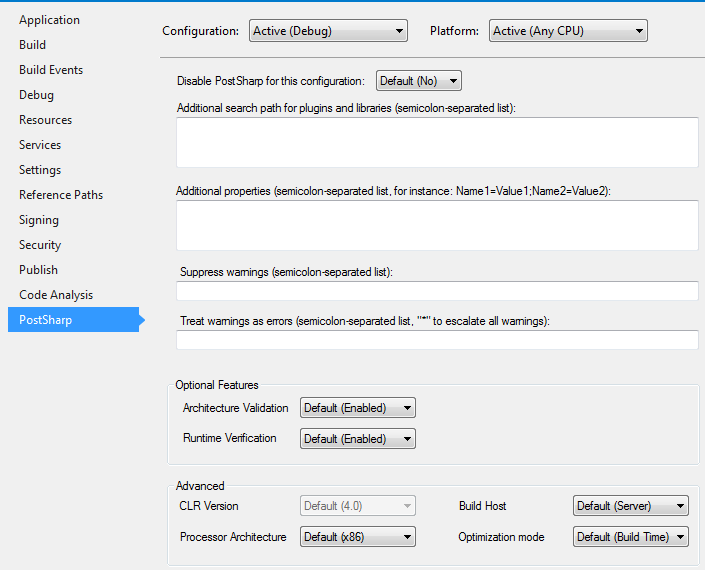
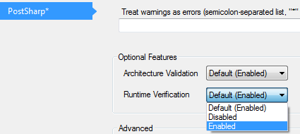

# Enabling and Disabling Runtime Verification

When you apply a threading model to a class, PostSharp adds two kinds of behaviors: behaviors that are necessary to implement the semantic of the threading model (for instance acquiring a lock or dispatching a method call) and behaviors that validate that the source code is valid against the chosen threading model (for instance that no field is written if the current method does not have write access). The second set of behaviors are called *runtime verifications*. By default, runtime verifications are enabled in the `Debug` build and disabled in the `Release` build. 

This section explains how to enable or disable runtime verification.


## Understanding the default configuration

By default, runtime verification is disabled if the **Optimize Code** compiler flag is enabled. Therefore, runtime verification is enabled by default in the `Debug` build and disabled in the `Release` build. 


## Enabling or disabling runtime verification for a whole project

Perform the following steps to enable runtime verification by using the Project Settings dialog


### Enabling Runtime Verification in Project Properties

1. Open the project's Properties window.

    


2. Select the build configuration that you want to enable runtime verification on.

    > [!NOTE]
    > By default, projects have two different build configurations: `Debug` and `Release`. Each build configuration can, and by default does, have a different behavior for runtime verification. 

    


3. Open the PostSharp tab.

    


4. In the Optional Features section there is a Runtime Verification dropdown. The dropdown has three options in it; `Default`, `Disabled`, and `Enabled`. 

    The `Default` option will include either `(Enabled)` or `(Disabled)` after it. This value will change based on the `Optimize Code` compiler flag setting. If the compiler flag is disabled the drop down option will read `Default (Enabled)` and if the `Optimize Code` flag is enabled the dropdown option will read `Default (Disabled)`. 

    


## Enabling and disabling runtime verification for a specific class

You can override the project-level configuration of the runtime verification setting by setting the <xref:PostSharp.Patterns.Threading.ThreadAwareAttribute.RuntimeVerificationEnabled> property of the threading model custom attribute. This property is defined by the <xref:PostSharp.Patterns.Threading.ThreadAwareAttribute> class, from which all threading model attributes derive. 

```csharp
[ThreadAffine(RuntimeVerificationEnabled = true)]
```

If the property is not manually set it derives its value from the setting on the project properties page. If you want to override the default value all you need to do is set the value of the <xref:PostSharp.Patterns.Threading.ThreadAwareAttribute.RuntimeVerificationEnabled> to `true` or `false`. 

## See Also

**Reference**

<xref:PostSharp.Patterns.Threading.ThreadAwareAttribute>
<br><xref:PostSharp.Patterns.Threading.ThreadAwareAttribute.RuntimeVerificationEnabled>
<br>